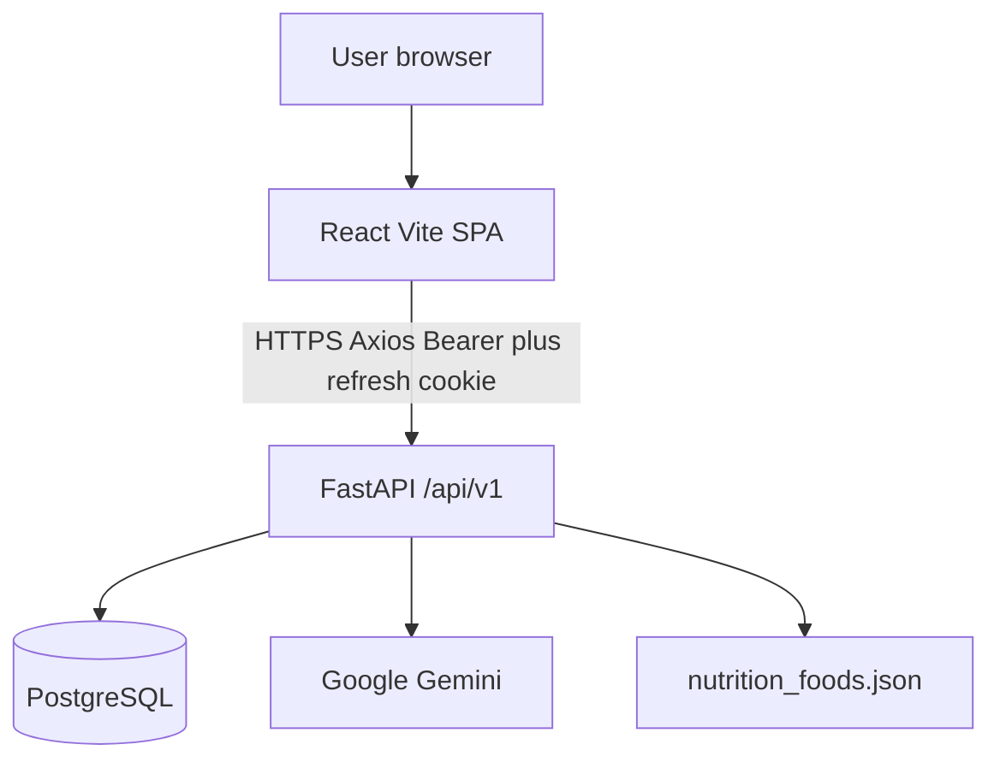
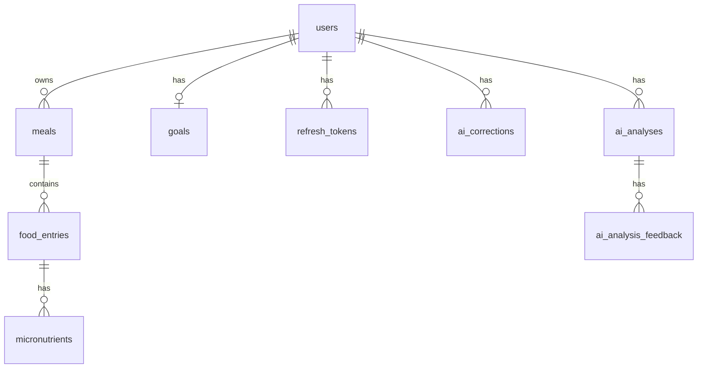
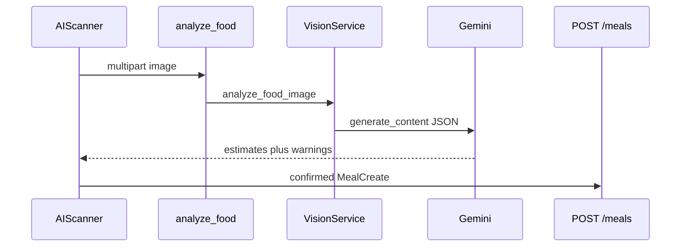
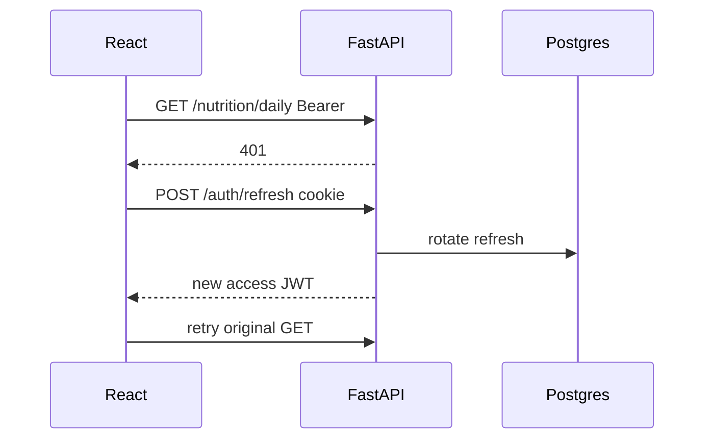
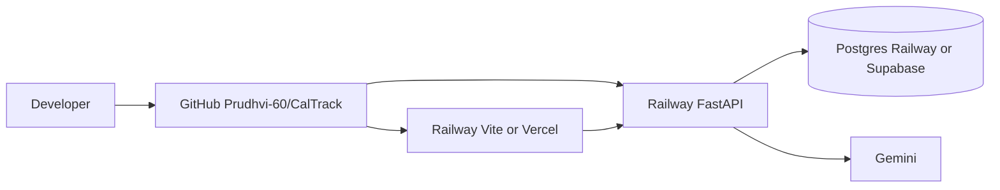

# CALTRACK

## Complete Technical & Interview Preparation Guide

| | |
| --- | --- |
| **Project** | CalTrack |
| **Document** | Technical Documentation & Interview Preparation |
| **Source analysis** | `docs/CALTRACK_INTERVIEW_PREP.md` (codebase inspection of `Prudhvi-60/CalTrack`) |
| **Purpose** | Complete, interview-ready understanding of the CalTrack codebase |
| **Rule** | Facts come from imports and call chains. Dependencies listed but unused are labeled unused. |

> **Interview tip:** Do not claim a library is used only because it appears in a lockfile. Usage in this handbook is from actual imports.

---

# TABLE OF CONTENTS

1. [Executive Summary](#1-executive-summary)
2. [Project Features](#2-project-features)
3. [Technology Stack](#3-technology-stack)
4. [System Architecture](#4-system-architecture)
5. [Project Structure](#5-project-structure)
6. [Frontend Architecture](#6-frontend-architecture)
7. [Backend Architecture](#7-backend-architecture)
8. [Database Architecture](#8-database-architecture)
9. [Authentication & Authorization](#9-authentication--authorization)
10. [API Architecture](#10-api-architecture)
11. [Complete Data Flows](#11-complete-data-flows)
12. [Deployment Architecture](#12-deployment-architecture)
13. [Environment Variables](#13-environment-variables)
14. [Security](#14-security)
15. [Error Handling](#15-error-handling)
16. [Performance & Scalability](#16-performance--scalability)
17. [Testing](#17-testing)
18. [Important Files](#18-important-files)
19. [Important Functions / Components](#19-important-functions--components)
20. [Technology Decisions](#20-technology-decisions)
21. [Technical Challenges](#21-technical-challenges)
22. [Known Limitations](#22-known-limitations)
23. [Future Improvements](#23-future-improvements)
24. [Interview Questions](#24-interview-questions)
25. [Mock Technical Interview](#25-mock-technical-interview)
26. [Pressure Questions](#26-pressure-questions)
27. [Debugging Playbook](#27-debugging-playbook)
28. [Interview-Ready Project Explanations](#28-interview-ready-project-explanations)
29. [Must-Know Concepts](#29-must-know-concepts)
30. [Final Cheat Sheet](#30-final-cheat-sheet)
31. [Last-Minute Revision](#31-last-minute-revision)

---

# 1. EXECUTIVE SUMMARY

CalTrack is a **personal calorie and nutrition tracker**. A signed-in user logs meals, sets daily macro goals, and reviews intake on a dashboard and reports. Meals can be entered by form, **AI photo/label scan**, **PDF meal-plan import**, or **chat tools**.

**Problem it solves:** people need one place to record food, compare intake to targets, and optionally get AI help without putting database or model keys in the browser.

**Target users:** individuals tracking their own nutrition. Data is **private per account**. There is no social feed and no multi-tenant org model.

**Overall architecture:** a **React 19 + TypeScript SPA** (Vite) talks **only** to a **FastAPI** REST API under `/api/v1`. FastAPI owns authentication, authorization, PostgreSQL persistence (SQLAlchemy 2 + Alembic), and **all Google Gemini calls**. The browser never opens Postgres or Gemini.

**Key technologies (implemented):** React, Vite, TypeScript, React Router, TanStack Query, Axios, React Hook Form, Zod, Tailwind, Recharts, FastAPI, Uvicorn, Pydantic, SQLAlchemy, Alembic, PostgreSQL, bcrypt, python-jose (JWT), google-genai (Gemini).

**Live URLs recorded in `README.md` at inspection time:**

- Frontend: `https://frontend-production-15c16.up.railway.app`
- API: `https://caltrack-production-c5cd.up.railway.app`
- OpenAPI: `/docs` · Health: `/health`

**Important honesty item:** `docs/DEPLOYMENT.md` describes **Vercel frontend + Railway API + Supabase Postgres**. The advertised live demo and `frontend/vite.config.ts` (`allowedHosts` includes the Railway frontend host) show **Railway hosting the frontend as well**. You cannot prove the live database hostname from git; startup classifies it as `supabase`, `railway`, `local`, or `remote` via `_database_label` in `backend/app/main.py`.

> **Interview line:** “The intended production split is Vercel + Railway + Supabase. The currently advertised live demo runs both UI and API on Railway.”

AI nutrition values are **estimates**. Scanner and PDF import **do not persist until confirm**. Chat write tools **do persist** after server-side Pydantic validation.

---

# 2. PROJECT FEATURES

Only features that exist in the repository.

| Feature | Description | Technologies Involved |
| --- | --- | --- |
| Register / login / logout / profile / password | Account lifecycle; access JWT in memory; HttpOnly refresh cookie | `Login.tsx`, `Register.tsx`, `Settings.tsx`, `AuthContext.tsx`, `/api/v1/auth/*`, bcrypt, JWT, `refresh_tokens` |
| Daily goals | One goal row per user: calories, protein, carbs, fat, optional weight | `Goals.tsx`, `/api/v1/goals`, `goals` table |
| Meal CRUD | Breakfast/lunch/dinner/snack with foods, macros, micronutrients; date/type/search filters; pagination | `Meals.tsx`, `MealForm.tsx`, `/api/v1/meals`, `meals`, `food_entries`, `micronutrients` |
| Dashboard | Today’s intake, remaining macros, weekly trend, meals, recent foods | `Dashboard.tsx`, `/nutrition/daily`, `/weekly`, `/goal-comparison` |
| Reports | 7 / 30 / 90 day trends, macros, micros, goal vs actual | `Reports.tsx`, `/nutrition/trends`, `/micronutrients`, `/goal-comparison?days=` |
| AI Scan | Upload JPEG/PNG/WEBP plate or nutrition label; review; then save | `AIScanner.tsx`, `POST /ai/analyze-food`, then `POST /meals`, Gemini |
| AI corrections | After confirm, store predicted vs corrected names/portions | `POST /ai/corrections`, `ai_corrections`, `ai_analysis_feedback` |
| Nutrition chat | Text assistant; tools can list nutrition or **create meals** | `Chat.tsx`, `POST /chat`, `ChatToolbox` |
| PDF meal-plan import | Upload PDF, review extracted days/foods, confirm save | `PdfImport.tsx` → `/import/meal-plan` + `/confirm`, Gemini + `nutrition_foods.json` |
| Table PDF import | Backend table parser exists | **API implemented; UI does not call it** (`previewPdf` unused by pages) |
| Health checks | Process, DB, AI config (never returns the key) | `/health`, `/health/ready`, `/health/ai`, `/health/db` |
| Training opt-in | Settings flag for collecting scan images/feedback | `PATCH /auth/me`, `allow_training_data_collection` |
| Offline classifier pipeline | CLI under `training/` | **Not on the FastAPI request path** |

---

# 3. TECHNOLOGY STACK

Legend: **Implemented** = imported and used. **Present but unused** = in files/deps but not on the live path. **Recommended** = not in the project; interview improvement.

## Frontend

| Technology | What it is | Why CalTrack uses it | Where | Alternatives | Tradeoffs |
| --- | --- | --- | --- | --- | --- |
| React 19 | UI library | Component dashboard SPA | `frontend/src/main.tsx` | Next.js, Vue | SPA needs rewrites for deep links; no SSR SEO (not needed for private app) |
| TypeScript | Typed JS | Safer API payloads | `tsconfig.json` | JSDoc JS | Types duplicated vs Pydantic |
| Vite 6 | Bundler / dev server | Fast HMR; `npm run build` | `vite.config.ts` | Webpack, CRA | `VITE_*` baked at build |
| React Router 7 | Client routing | Nested guest/protected routes | `App.tsx` | TanStack Router | SPA 404s without host rewrites |
| TanStack Query 5 | Server-state cache | Meals/nutrition/goals cache + invalidation | `queryClient.ts`, hooks | Redux, SWR | Auth is **not** in Query; it is Context |
| React Context | Auth session | `user`, `isLoading`, login/logout | `AuthContext.tsx` | Zustand | Fine for one session object |
| Axios | HTTP client | Interceptors, `withCredentials` | `api/client.ts` | fetch | Extra dependency; interceptors are the reason |
| React Hook Form + Zod | Forms + schema | Field arrays on meals; client validation | Login, Register, Settings, `MealForm` | Formik | Must still validate on server |
| Tailwind 3 | Utility CSS | Responsive layout, design tokens | `index.css`, `tailwind.config.ts` | CSS modules | Class-heavy JSX |
| shadcn-style UI | Copied primitives | Button, Input, Card | `components/ui/*`, `components.json` | MUI | Not a full design-system install |
| Radix Slot | `asChild` | `button.tsx` only | `@radix-ui/react-slot` | native buttons | Lightly used |
| lucide-react | Icons | Nav icons | `AppLayout.tsx` | Heroicons | Cosmetic |
| Recharts | Charts | Dashboard/reports | `components/charts/*` | Chart.js | Bundle size (Vite may warn >500 kB) |
| npm | Packages | Lockfile | `package-lock.json` | pnpm, yarn | — |
| Vitest + Testing Library | UI tests | Page validation tests | `*.test.tsx` | Jest | **No E2E** |

**Not used (common interviewer traps):** Redux, Zustand, Next.js, Supabase JS, accessing the refresh cookie from JavaScript.

## Backend

| Technology | What it is | Why | Where | Alternatives | Tradeoffs |
| --- | --- | --- | --- | --- | --- |
| Python 3.12 | Runtime | Typed backend | `.python-version`, `runtime.txt` | 3.11 | — |
| FastAPI 0.115 | HTTP framework | OpenAPI, Pydantic, Depends | `app/main.py` | Django Ninja, Flask | Sync SQLAlchemy can block workers |
| Uvicorn | ASGI server | Production process | `railway.toml`, Dockerfile | Gunicorn+uvicorn | Railway `$PORT` |
| Pydantic v2 + settings | Schemas + env | Request validation | `schemas/*`, `core/config.py` | marshmallow | — |
| SQLAlchemy 2 | ORM | Models + queries | `models/`, `repositories/` | raw SQL, Django ORM | — |
| Alembic | Migrations | Schema source of truth | `alembic/versions/0001`–`0004` | `create_all` | App **does not** `create_all` |
| psycopg 3 | Driver | `postgresql+psycopg://` | `database_url.py` | psycopg2 | URL rewrite from `postgres://` |
| python-jose | JWT HS256 | Access tokens | `core/security.py` | PyJWT | HS256 shared secret |
| bcrypt | Password hashes | 12 rounds, 72-byte cap | `hash_password` | argon2 | Truncation at 72 bytes is explicit |
| google-genai | Gemini SDK | Vision + chat JSON | `gemini_client.py` | OpenAI, local VLMs | Cost, 503 if key missing |
| python-multipart | Uploads | Images/PDFs | analyze-food, import | — | 5 MB cap |
| pdfplumber | PDF tables | Table import path | `pdf_parser.py` | pypdf | UI uses meal-plan path instead |
| httpx | HTTP client | Listed in requirements | `provider_http.py` **not imported** | — | Leftover xAI-style helper |
| pytest | Tests | API + parsing | `backend/app/tests/` | unittest | Needs real Postgres URL |

**Not implemented:** Celery, Redis, Kafka, GraphQL, Django, Flask, WebSockets, Supabase Auth/RLS.

## Database

**Implemented:** PostgreSQL 16 in `docker-compose.yml` for local. Production documented as **Supabase session pooler**; live `DATABASE_URL` is runtime-only.

**Recommended (not implemented):** read replicas, PgBouncer in front of a dedicated instance if not using Supabase pooler.

## Authentication

**Implemented:** Custom FastAPI JWT (access) + hashed refresh tokens in Postgres + HttpOnly cookie. **Not** Auth0, Clerk, or Supabase Auth.

## APIs

**Implemented:** REST under `/api/v1` plus RPC-style POSTs for AI/chat/import. OpenAPI at `/docs`.

## Deployment

**Implemented in repo:** Railway Nixpacks config (`backend/railway.toml`), backend Dockerfile, frontend Dockerfile (**Vite `npm run dev`**), `frontend/vercel.json` SPA rewrites, compose file.

**Documented target vs live:** see Executive Summary. **No `.github/workflows`.**

## Development Tools

npm, pip, ESLint, Vitest, pytest, Docker Compose, Alembic CLI.

## Third-Party Services

| Service | Implemented? | Role |
| --- | --- | --- |
| Google Gemini | **Yes** (server only) | Scan, chat, meal-plan extract |
| Railway | **Yes** (advertised live API + UI) | Hosting |
| Vercel | **Configured** (`vercel.json`) / **not proven live** | Documented frontend host |
| Supabase | **Documented as Postgres host** / **unverified from git** | Hosted Postgres only, not Auth |
| GitHub | **Yes** | Source: `Prudhvi-60/CalTrack` |
| USDA / nutrition APIs | **No** | JSON file instead |

---

# 4. SYSTEM ARCHITECTURE

**Classification:** **modular monolith** + **layered REST API** (routes → services → repositories → ORM). Not microservices. Not Django MVC (no template views).



**Components (only these):**

| Component | Responsibility |
| --- | --- |
| React SPA | UI, auth restore, forms, charts. Never holds DB/Gemini secrets |
| Axios `apiClient` | Base URL, Bearer header, cookie credentials, 401 refresh |
| FastAPI | Auth, validation, CORS, rate limits, routing |
| Services | Transactions and domain logic; reused by HTTP and chat tools |
| Repositories | SQLAlchemy queries scoped by `user_id` |
| PostgreSQL | Users, meals, goals, tokens, AI feedback |
| Gemini | Vision JSON, chat+tools, meal-plan extraction |
| `nutrition_foods.json` | In-process food matching for **PDF meal-plan**, not photos |

Gemini and Postgres are **never** reached from the browser.

---

# 5. PROJECT STRUCTURE

```text
CalTrack/
  README.md
  .env.example
  docker-compose.yml
  frontend/          React + Vite SPA
  backend/           FastAPI, Alembic, tests
  docs/              Architecture, deployment, this handbook
  training/          Offline classifier CLI (not live inference)
  tests/data/        Extra image fixtures
```

| Path | Purpose | Important contents |
| --- | --- | --- |
| `frontend/src/main.tsx` | App bootstrap | QueryClient, Router, AuthProvider |
| `frontend/src/App.tsx` | Route table | Guest vs protected |
| `frontend/src/api/client.ts` | HTTP + refresh | Axios interceptors |
| `frontend/src/api/token.ts` | In-memory access JWT | `getAccessToken` / `setAccessToken` |
| `frontend/src/contexts/AuthContext.tsx` | Session | restore, login, logout |
| `frontend/src/pages/*` | Screens | Dashboard, Meals, AIScanner, Chat, PdfImport, … |
| `frontend/vite.config.ts` | Dev proxy `/api` → `:8001` | Railway `allowedHosts` |
| `backend/app/main.py` | FastAPI app | CORS, handlers, routers |
| `backend/app/core/*` | Config, security, cookies, rate limit | `get_current_user` |
| `backend/app/api/routes/*` | HTTP endpoints | auth, meals, goals, nutrition, ai, chat, pdf, health |
| `backend/app/services/*` | Business logic | auth, meal, goal, nutrition, AI, PDF |
| `backend/app/repositories/*` | Queries | user, meal, goal |
| `backend/app/models/*` | ORM tables | User, Meal, Goal, RefreshToken, … |
| `backend/alembic/versions/` | Schema | `0001`–`0004` |
| `backend/railway.toml` | Railway build/start | `alembic upgrade head`, uvicorn `$PORT` |

**Critical file relationships:** pages import hooks → hooks import `api/*.ts` → `apiClient` → FastAPI routes → services → repositories → models. Chat skips the HTTP meal route but still calls `MealService`.

---

# 6. FRONTEND ARCHITECTURE

**Entry:** `index.html` → `main.tsx` → `App`.

**Provider tree** (`main.tsx`):

```text
QueryClientProvider
  BrowserRouter
    AuthProvider
      App.tsx
        ProtectedRoute → AppLayout → pages
        GuestRoute → Login / Register
      api/*.ts  (also used by AuthProvider)
```

**Routing (`App.tsx`):**

- Guest (`GuestRoute`): `/login`, `/register`
- Protected + `AppLayout`: `/dashboard`, `/meals`, `/meals/new`, `/meals/:mealId`, `/meals/:mealId/edit`, `/goals`, `/reports`, `/ai-scan`, `/chat`, `/import`, `/settings`
- `/` → `/dashboard`
- Unknown protected paths → `NotFound`

**State:**

- Auth: Context (`user`, `isLoading`). Access token is a **module variable**, not `localStorage`.
- Server data: Query keys `["meals"]`, `["nutrition", …]`, `["goals"]`. `staleTime` 30s, `refetchOnWindowFocus: false`, retry once except 401/403/404/422.
- Chat: local `useState` only (lost on refresh).
- AI scan analysis: local state until confirm.

**API communication:** `apiClient` `withCredentials: true`. Empty `VITE_API_URL` locally → same-origin `/api` proxy to `127.0.0.1:8001`. Production origin is baked (or Railway env if running Vite).

**Forms / validation:** Zod + RHF. Server still validates with Pydantic.

**Loading / errors:** `isLoading` + `PageSkeleton`; `ErrorAlert` + `getApiErrorMessage`.

**Responsive:** Tailwind grids; `AppLayout` desktop nav vs 4-column mobile nav (`lg:hidden`). Skip link for a11y.

**SPA hosting:** `frontend/vercel.json` rewrites `/(.*)` → `/index.html`.

---

# 7. BACKEND ARCHITECTURE

**Entry:** `uvicorn app.main:app`.

**Lifespan:** init/close shared Gemini client.

**Middleware (Starlette: last added runs first):** CORS → RequestContext → RateLimit → SecurityHeaders.

**Pattern:** thin **routes** (`api/routes/*.py`) → **services** → **repositories** → **SQLAlchemy models**. Pydantic **schemas** at the HTTP boundary. FastAPI `Depends(get_db)` and `Depends(get_current_user)`.

**Routers** (health also without prefix): `/api/v1/auth`, `/goals`, `/meals`, `/nutrition`, `/ai`, `/chat`, `/import`, `/health`. Health is mounted twice (`/health` and `/api/v1/health`).

**Config:** `pydantic-settings` in `core/config.py`. On Railway (`RAILWAY_ENVIRONMENT` / `RAILWAY_PROJECT_ID`), packaged `.env` files are **not** loaded.

**Errors:** `AppError` → `{ error: { code, message } }`. Validation 422. Unhandled 500 `INTERNAL_ERROR` with **no traceback in the body**. `X-Request-ID` on responses.

**Logging:** `caltrack` logger; HTTP access log skips health paths.

---

# 8. DATABASE ARCHITECTURE

**Technology:** PostgreSQL via SQLAlchemy 2 + Alembic (`0001_initial` … `0004_ai_feedback`).



**Not a table:** `backend/app/data/nutrition_foods.json` and `food_aliases.json` (in-process lookup for PDF meal-plan matching).

### Tables (implemented)

| Table | PK | Notable columns | Relationships / constraints |
| --- | --- | --- | --- |
| `users` | `id` | email unique, `password_hash`, `name`, `token_version`, `allow_training_data_collection` | Cascades to children |
| `goals` | `id` | calorie/protein/carb/fat targets, optional `weight_goal` | `UNIQUE(user_id)`; CHECK ≥ 0 |
| `meals` | `id` | `meal_type` enum, `consumed_at` timestamptz, `notes` | FK `user_id` CASCADE; indexes on user+time, user+type |
| `food_entries` | `id` | name, quantity, unit, macros | FK `meal_id` CASCADE; CHECK ≥ 0 |
| `micronutrients` | `id` | `nutrient_name`, amount, unit | FK `food_entry_id` CASCADE |
| `refresh_tokens` | `id` | SHA-256 `token_hash` unique, `expires_at`, `revoked_at`, `replaced_by` | FK user CASCADE; `replaced_by` SET NULL |
| `ai_corrections` | `id` | predicted vs corrected name/qty/unit | FK user |
| `ai_analyses` | UUID string `id` | `analysis_type`, optional `image_reference` | FK user |
| `ai_analysis_feedback` | `id` | predicted/corrected, `include_in_training` | FK user; analysis SET NULL |

**Important queries:** `MealRepository.get_for_user` (`id` AND `user_id`); `list_for_user` filters + pagination; `macros_by_day` JOIN `food_entries` GROUP BY UTC date; refresh lookup by `token_hash`.

**CRUD:** meals/goals via services that `commit`. Meal **totals are computed** (`sum_food_macros`), not stored.

**Connection:** `resolved_database_url` → `sqlalchemy_database_url` (psycopg, `sslmode=require` for non-local non-`.railway.internal`). Pool 5 / overflow 10, `pool_pre_ping`. Port **6543** (Supabase transaction pooler) → `NullPool` + `prepare_threshold=None`.

**Production:** `preDeployCommand = alembic upgrade head`. Seed script is **local/demo only**.

---

# 9. AUTHENTICATION & AUTHORIZATION

### Actual lifecycle

Registration / Login  
→ bcrypt verify or create user  
→ insert hashed refresh row  
→ Set-Cookie `caltrack_refresh` (HttpOnly, path `/api/v1/auth`)  
→ JSON access JWT (15 minutes, HS256, claims `sub`, `user_id`, `type=access`, `ver`)  
→ frontend stores access token **in memory** (`token.ts`)  
→ Axios sends `Authorization: Bearer`  
→ `get_current_user` decodes JWT, loads user, compares `token_version`  
→ repositories filter `user_id` (other users’ IDs → **404**)  
→ logout: `token_version++`, revoke all refresh rows, clear cookie, BroadcastChannel

Login does **not** revoke other devices’ refresh tokens. Logout and password change do.

**Refresh:** `POST /api/v1/auth/refresh` reads cookie, SHA-256 lookup. If the row is **already revoked**, **revoke all** (reuse detection). Rotate: new row, old `revoked_at` + `replaced_by`. Production cookie: Secure; SameSite forced to `none` if production would otherwise be `lax`.

**Files:** `backend/app/api/routes/auth.py`, `services/auth_service.py`, `core/security.py`, `core/cookies.py`, `core/dependencies.py`, `frontend/src/api/client.ts`, `token.ts`, `AuthContext.tsx`, `ProtectedRoute.tsx`.

### How does authentication work in CalTrack?

> CalTrack uses our own FastAPI JWT, not Auth0 or Supabase Auth. Register and login return a short-lived access JWT and set an HttpOnly cookie `caltrack_refresh`. The React app keeps the access token in a module variable, not localStorage. Axios sends the Bearer header. After about 15 minutes a 401 triggers `POST /api/v1/auth/refresh` with credentials; the server hashes the cookie, rotates the row, and returns a new access token. Logout bumps `token_version` so old access tokens fail, and revokes refresh rows. Protected React routes wait for AuthContext restore, then redirect to `/login`. All data queries are scoped to `current_user.id`.

---

# 10. API ARCHITECTURE

**Style:** Versioned REST (`/api/v1`) for auth, meals, goals, nutrition. RPC-style **POST** for AI, chat, and import (side effects or files). Unified error envelope. OpenAPI at `/docs`.

**Auth:** Bearer required on all meal/goal/nutrition/AI/chat/import routes. Register/login/refresh are public (rate limited). Logout optional Bearer.

**CORS:** `FRONTEND_URL` + `CORS_ORIGINS`, `allow_credentials=True`, **no wildcard**. Production strips localhost origins.

**Rate limit (implemented):** in-process sliding window — auth 20/min/IP; AI/chat/import 10/min/IP. **Not Redis.**

### Endpoint inventory (implemented)

| Method | Endpoint | Purpose | Auth | Request | Response |
| --- | --- | --- | --- | --- | --- |
| GET | `/` | API name + links | No | — | JSON meta |
| GET | `/health`, `/api/v1/health` | Liveness | No | — | `{status: ok}` |
| GET | `/health/ready` | Postgres `SELECT 1` | No | — | connected / 500 |
| GET | `/health/db` | Same DB ping | No | — | connected |
| GET | `/health/ai` | Gemini configured? | No | — | booleans + model name, **not the key** |
| POST | `/api/v1/auth/register` | Create user | No | `{name,email,password}` | 201 TokenResponse + cookie |
| POST | `/api/v1/auth/login` | Sign in | No | `{email,password}` | TokenResponse + cookie |
| POST | `/api/v1/auth/refresh` | Rotate session | Cookie | — | TokenResponse + new cookie |
| POST | `/api/v1/auth/logout` | Revoke | Optional Bearer + cookie | — | `{message}` |
| GET | `/api/v1/auth/me` | Profile | Bearer | — | UserPublic |
| PATCH | `/api/v1/auth/me` | Name / training opt-in | Bearer | UserUpdate | UserPublic |
| POST | `/api/v1/auth/change-password` | Password + revoke sessions | Bearer | current + new | `{message}` |
| GET | `/api/v1/goals` | List (≤1 row) | Bearer | page | GoalListResponse |
| POST | `/api/v1/goals` | Create | Bearer | GoalCreate | 201 / 409 |
| PUT | `/api/v1/goals` | Replace | Bearer | GoalUpdate | GoalPublic |
| PATCH | `/api/v1/goals` | Partial | Bearer | GoalPatch | GoalPublic |
| DELETE | `/api/v1/goals` | Delete | Bearer | — | `{message}` |
| GET | `/api/v1/meals` | List + filters | Bearer | date, range, type, q, page | MealListResponse |
| POST | `/api/v1/meals` | Create | Bearer | MealCreate | 201 MealPublic |
| GET | `/api/v1/meals/{id}` | Get | Bearer | — | MealPublic / 404 |
| PUT | `/api/v1/meals/{id}` | Replace | Bearer | MealUpdate | MealPublic |
| DELETE | `/api/v1/meals/{id}` | Delete | Bearer | — | `{message}` |
| GET | `/api/v1/nutrition/daily` | Day snapshot | Bearer | date? | DailyNutritionResponse |
| GET | `/api/v1/nutrition/weekly` | 7 UTC days | Bearer | end_date? | WeeklyNutritionResponse |
| GET | `/api/v1/nutrition/trends` | 7/30/90 | Bearer | days, page | TrendListResponse |
| GET | `/api/v1/nutrition/micronutrients` | Aggregated micros | Bearer | days or range | MicronutrientListResponse |
| GET | `/api/v1/nutrition/goal-comparison` | Goal vs actual | Bearer | date or days | GoalComparisonResponse |
| POST | `/api/v1/ai/analyze-food` | Vision estimates | Bearer | multipart file + `analysis_type` | FoodAnalysisResult (**no meal insert**) |
| POST | `/api/v1/ai/corrections` | Store edits | Bearer | AiCorrectionCreate | list public rows |
| POST | `/api/v1/chat` | Assistant + tools | Bearer | `{message, history}` | `{reply, tools_used}` |
| POST | `/api/v1/import/pdf` | Table preview | Bearer | PDF | preview rows (**unused by UI**) |
| POST | `/api/v1/import/pdf/confirm` | Save table rows | Bearer | rows | imported meals |
| POST | `/api/v1/import/meal-plan` | Gemini preview | Bearer | PDF | days/foods (**used by UI**) |
| POST | `/api/v1/import/meal-plan/confirm` | Save reviewed plan | Bearer | days | imported meals |

**Status codes used:** 200, 201, 401, 404, 409, 413, 422, 429, 500, 502, 503, 504.

**Why verbs:** GET reads; POST creates or RPCs; PUT full replace; PATCH partial; DELETE remove.

---

# 11. COMPLETE DATA FLOWS

### Login

User submits `Login.onSubmit` → `useAuth().login` → `loginUser` `POST /auth/login` → `AuthService.login` → bcrypt → insert `refresh_tokens` → Set-Cookie + JSON → `setAccessToken` + `setUser` → `navigate(from)`.

### Create meal

`MealForm.handleSubmit` → `useCreateMeal` → `POST /meals` → `MealService.create` → INSERT meal+foods+micros → 201 → `invalidateMealRelated` (`["meals"]`, `["nutrition"]`).

### Dashboard

`useDailyNutrition` `GET /nutrition/daily` → `NutritionService.daily` (UTC today totals + remaining). Also weekly + goal-comparison queries.

### AI Scan

`AIScanner.onAnalyze` FormData `POST /ai/analyze-food` → `analyze_image` (magic bytes, ≤5 MB) → `VisionService` Gemini JSON → `FoodAnalysisPipeline.finalize_llm_photo` (`nutrition_source: llm`, **no JSON food DB**) → review `MealForm` → `createMeal` + `recordAiCorrections`.



### Chat

`sendChatMessage` `POST /chat` → `ChatService.ask` (today snapshot + last 12 messages) → Gemini tools, max 6 rounds → `ChatToolbox.execute` (same `MealService` / `GoalService`). **Writes persist immediately.**

### PDF import (what the UI actually does)

`PdfImport.onFile` → `previewMealPlan` `POST /import/meal-plan` → text/OCR → Gemini extract → match `nutrition_foods.json` → review → `confirmMealPlan`. Table `/import/pdf` is **not** called by the page.

### Authenticated request after 15 minutes



---

# 12. DEPLOYMENT ARCHITECTURE



| Piece | Documented target | Advertised live | Evidence in repo |
| --- | --- | --- | --- |
| Frontend | Vercel | Railway `frontend-production-15c16` | `vercel.json`, Vite `allowedHosts` |
| Backend | Railway Nixpacks | Railway `caltrack-production-c5cd` | `railway.toml` |
| Database | Supabase session pooler :5432 | Unverified from git | `DATABASE_URL` aliases, `_database_label` |
| CI | — | **None committed** | no `.github/workflows` |

**I could not verify Railway/Vercel dashboard webhooks from git.** Expected if connected: push to `main` rebuilds services.

**Backend start:** `uvicorn app.main:app --host 0.0.0.0 --port ${PORT:-8000}`  
**Pre-deploy:** `alembic upgrade head`  
**Healthcheck in railway.toml:** `/health` (process only — **not** `/health/ready`)  
**Frontend build (Vercel docs):** `npm run build`, output `dist`  
**Frontend Docker (compose):** `CMD npm run dev` — **not** a production static server

### Local development

1. Copy `.env.example` and `frontend/.env.example`. Leave `VITE_API_URL` empty.
2. `docker compose up postgres -d`
3. Backend venv, `pip install -r requirements.txt`, `alembic upgrade head`, optional `python -m scripts.seed`, uvicorn on `127.0.0.1:8001`
4. Frontend `npm install && npm run dev` → `http://localhost:5173`
5. Full compose is optional and runs the **Vite dev** frontend image.

### Production

Browser loads SPA → HTTPS to FastAPI → SQLAlchemy to Postgres → Gemini when scan/chat/import need it. CORS must match the exact frontend origin. `VITE_API_URL` must be the API origin **without** `/api/v1` and **without** a trailing slash.

### After push

If GitHub is connected: Railway rebuilds API (migrate + uvicorn). If Vercel is connected: rebuild SPA and **re-inline** `VITE_API_URL`. **Tests do not run automatically** (no Actions).

---

# 13. ENVIRONMENT VARIABLES

**Never print secret values.** None are included here.

| Variable | Purpose | FE/BE | Secret? | Used in |
| --- | --- | --- | --- | --- |
| `VITE_API_URL` | API origin | FE | No | `client.ts` |
| `VITE_API_BASE_URL` | Alias | FE | No | `client.ts` |
| `VITE_API_TIMEOUT_MS` | Axios timeout | FE | No | `client.ts` |
| `VITE_DEV_PROXY_TARGET` | Vite `/api` proxy | FE | No | `vite.config.ts` |
| `DATABASE_URL` | Postgres URI | BE | **Yes** | `config.py`, Alembic |
| `SUPABASE_DATABASE_URL` | Alias | BE | **Yes** | same |
| `POSTGRES_URL` | Alias | BE | **Yes** | same |
| `DB_POOL_*` | Pool size/overflow/timeout/recycle | BE | No | `database.py` |
| `ENVIRONMENT` | development / test / production | BE | No | settings |
| `LOG_LEVEL` | Logging | BE | No | `main.py` |
| `JWT_SECRET_KEY` | Sign JWT | BE | **Yes** | `security.py` |
| `JWT_ALGORITHM` | Default HS256 | BE | No | security |
| `ACCESS_TOKEN_EXPIRE_MINUTES` | 15 | BE | No | security |
| `REFRESH_TOKEN_EXPIRE_DAYS` | 14 | BE | No | `auth_service` |
| `COOKIE_SECURE` / `COOKIE_SAMESITE` | Refresh cookie | BE | No | `cookies.py` |
| `RATE_LIMIT_ENABLED` | Toggle | BE | No | `rate_limit.py` |
| `AUTH_RATE_LIMIT_PER_MINUTE` | 20 | BE | No | rate_limit |
| `AI_RATE_LIMIT_PER_MINUTE` | 10 | BE | No | rate_limit |
| `GEMINI_API_KEY` / `AI_API_KEY` / `GOOGLE_API_KEY` | Gemini | BE | **Yes** | `gemini_client` |
| `AI_PROVIDER` | Must be Gemini in prod | BE | No | config |
| `AI_MODEL` | Model id (default `gemini-3.1-flash-lite`) | BE | No | gemini, `/health/ai` |
| `AI_TIMEOUT_SECONDS` | 45 | BE | No | settings |
| `AI_MAX_UPLOAD_BYTES` | 5 MB | BE | No | analyze/import |
| `AI_MIN_CONFIDENCE` | 0.5 setting | BE | No | **Do not claim scans use this;** pipeline warns at 0.55 |
| `FRONTEND_URL` / `CORS_ORIGINS` | CORS | BE | No | CORS middleware |
| `BACKEND_HOST` / `BACKEND_PORT` | Local bind examples | BE | No | uvicorn CLI is what runs |
| `PORT` | Railway injects | BE | No | `railway.toml` |
| `RAILWAY_ENVIRONMENT` / `RAILWAY_PROJECT_ID` | Detect Railway; skip `.env` | BE | No | `config.py` |
| `TRAINING_DATA_DIR` | Optional image dump | BE | No | `feedback_service.py` |

**Safe in the browser:** only `VITE_*`.

**Dev vs prod:** local JWT default allowed (warning). Production rejects default/short JWT, empty/localhost DB, SQLite, empty CORS. Production CORS ignores localhost. Production cookie SameSite becomes `none` if set to `lax`. Railway does not load packaged `.env`.

**Missing vars:** production can `RuntimeError` on bad DB/JWT. Frontend prod logs if `VITE_API_URL` empty and API calls break.

**Why env vars:** different hosts, no secrets in git, Vite inlines public API origin at build.

---

# 14. SECURITY

### Implemented

- bcrypt 12 rounds; passwords max 72 characters in schemas
- JWT secret ≥ 32 characters required in production
- Refresh tokens stored as SHA-256 hashes; HttpOnly cookie; path limited to `/api/v1/auth`
- CORS allowlist + credentials; no `*`
- SQLAlchemy bound parameters; `escape_like` for search
- Image magic-byte sniff, size, pixel limits; PDF size cap
- Security headers: nosniff, `X-Frame-Options: DENY`, Referrer-Policy, Permissions-Policy; HSTS in production
- In-process rate limits on auth and AI/import
- No stack traces in JSON; Gemini error sanitizer redacts key-like strings
- Gemini key only on the server
- Training images gitignored under `training/data/raw/images/*`
- IDOR: `user_id` in queries; 404 not 403

### XSS

React interpolation is escaped. Inspected pages do not use `dangerouslySetInnerHTML`. Chat is `whitespace-pre-wrap` text. Access token in memory is harder to steal from storage than `localStorage`, but XSS can still call APIs while the tab is open.

### CSRF

**Not currently implemented** as tokens. Meal APIs need a Bearer header (foreign form posts will not send it). `POST /auth/refresh` and `/logout` **only need the cookie**. With `SameSite=None; Secure`, a cross-site form POST could hit those cookie endpoints. Improvement: same-site parent domain + `SameSite=Lax`, or double-submit CSRF token.

### Also not currently implemented

Access-token denylist (uses `token_version` instead); Redis rate limit; WAF; email verification; 2FA; Postgres RLS; upload virus scan; Content-Security-Policy on the SPA; account lockout beyond IP rate limit.

HTTPS is assumed at the host; the API sets HSTS when `is_production`.

---

# 15. ERROR HANDLING

| Layer | Mechanism |
| --- | --- |
| Frontend network | Axios 30s (60s AI, 120s meal-plan) |
| Frontend mapping | `getApiErrorMessage` by status/code |
| UI | `ErrorAlert`; form Zod errors; Query `error` |
| Backend domain | `AppError(code, message, status)` |
| Validation | Pydantic → 422 `VALIDATION_ERROR` + details |
| Gemini | `map_gemini_error` → 502/429/504/400 |
| Unique DB | IntegrityError → 409 `DUPLICATE_EMAIL` / `GOAL_EXISTS` |
| Unhandled | 500 `INTERNAL_ERROR`; `logger.exception` with request id |
| Auth | 401 `UNAUTHORIZED` / `INVALID_CREDENTIALS` |
| Missing Gemini | 503 `AI_NOT_CONFIGURED` |

**Logging:** request method/path/status/duration/`rid`. Health paths skipped. Production quiets some expected AppErrors.

---

# 16. PERFORMANCE & SCALABILITY

### Existing optimizations (only these)

- Meal list pagination (`page_size` ≤ 100)
- `selectinload` foods (and micros when needed)
- Composite indexes `(user_id, consumed_at)`, `(user_id, meal_type)`
- `macros_by_day` SQL `GROUP BY`
- React Query `staleTime` 30s
- Process-wide Gemini client
- 5 MB upload cap

### Potential bottlenecks

- Gemini latency and quota
- Single API instance
- In-memory rate limiter (per process)
- Pool size 5
- Dashboard three parallel nutrition calls
- Frontend bundle warning >500 kB; **no** `React.lazy` splitting observed
- UTC-only windows (not a perf issue, a correctness issue)

### How would you scale to 100,000+ users?

Keep the monolith first. Put the SPA on a CDN/static host. Run several Uvicorn workers behind Railway/a load balancer. Move Gemini to a **job queue** with retries and user-facing “analyzing…” state. Put Redis in front of rate limits. Raise or externalize the DB pool; use session pooler :5432. Cache `GET /nutrition/daily` per user+UTC date. Add indexes if new query patterns appear. Split AI into a worker service only if Gemini wait time dominates.

**First bottleneck:** Gemini and a single API dyno, then Postgres aggregations and the in-memory limiter.

---

# 17. TESTING

| Kind | Present? | Where |
| --- | --- | --- |
| Backend API / integration | **Yes** | pytest `backend/app/tests/` (~22 modules), `TestClient`, transaction rollback, **real Postgres engine** |
| AI parsing / chat tools / PDF | **Yes** | mocked completers in tests |
| Frontend unit/UI | **Yes** | Vitest + Testing Library (Login, Dashboard, Goals, Chat, AIScanner, Meals, Reports, PdfImport, NewMeal, App) |
| E2E (Playwright/Cypress) | **No** | — |
| CI on push | **No** | no GitHub Actions |
| Load / contract / visual | **No** | — |

**Should add before serious production:** Playwright login→meal; OpenAPI contract tests; pytest+vitest in Actions; a Gemini sandbox test with recorded fixtures.

---

# 18. IMPORTANT FILES

### MUST UNDERSTAND

| Path | Purpose | Why interviewers ask |
| --- | --- | --- |
| `frontend/src/api/client.ts` | Axios + refresh | “How do you talk to the API?” |
| `frontend/src/api/token.ts` | Memory JWT | “Where is the token stored?” |
| `frontend/src/contexts/AuthContext.tsx` | Session restore | “How does the UI know you’re logged in?” |
| `frontend/src/App.tsx` | Routes | Feature list |
| `backend/app/main.py` | App + CORS + errors | Architecture entry |
| `backend/app/core/security.py` | bcrypt/JWT | Auth internals |
| `backend/app/core/dependencies.py` | `get_current_user` | Authorization |
| `backend/app/services/auth_service.py` | Register/login/refresh/logout | Token rotation |
| `backend/app/services/meal_service.py` | Meal CRUD | IDOR 404 |
| `backend/app/repositories/meal_repository.py` | `user_id` filters | SQL |
| `backend/app/services/ai/analyze_service.py` | Scan pipeline | “Does AI auto-save?” (no) |
| `backend/app/services/ai/chat_tools.py` | Chat writes | “Does chat auto-save?” (yes) |
| `backend/railway.toml` | Deploy | DevOps questions |

### SHOULD UNDERSTAND

`config.py`, `cookies.py`, `rate_limit.py`, `database_url.py`, `nutrition_service.py`, `gemini_client.py`, `chat_service.py`, `pipeline.py`, `ProtectedRoute.tsx`, `MealForm.tsx`, `queryClient.ts`, `vite.config.ts`.

### NICE TO KNOW

`pdf_parser.py` vs `meal_plan_service.py`, `feedback_service.py`, `training/` scripts, leftover `provider_http.py`, `theme/palette.ts`.

---

# 19. IMPORTANT FUNCTIONS / COMPONENTS

**1. `get_current_user`** — `backend/app/core/dependencies.py`  
Bearer decode; compare `token_version`; 401. Depends on `decode_access_token`, `AuthService.get_user`. *“How is the user loaded on each request?”*

**2. `create_access_token` / `decode_access_token`** — `security.py`  
HS256; reject non-`access` type. *“What’s in the JWT?”*

**3. `AuthService.refresh`** — `auth_service.py`  
Hash cookie; reuse ⇒ `_revoke_all`; rotate. *“What if a refresh token is stolen and replayed?”*

**4. Axios response interceptor** — `client.ts`  
Single-flight `refreshInFlight`; skip auth URLs; dispatch `caltrack:unauthorized`. *“What happens on 401?”*

**5. `MealRepository.get_for_user`** — `meal_repository.py`  
`Meal.id` AND `user_id`. *“How do you prevent IDOR?”*

**6. `MealService._require` / `create`** — `meal_service.py`  
404 if missing; insert nested foods. *“Walk through POST /meals.”*

**7. `NutritionService.goal_comparison`** — `nutrition_service.py`  
Period target = daily goal × day count. *“How is goal vs actual calculated?”*

**8. `analyze_image`** — `analyze_service.py`  
Type sniff vs Content-Type; size; vision; optional `FeedbackService.start_analysis`. Output estimates only. *“Does analyze insert a meal?”* No.

**9. `FoodAnalysisPipeline.finalize_llm_photo`** — `pipeline.py`  
Sets `nutrition_source: llm`. *“Do photos use nutrition_foods.json?”* No.

**10. `ChatService.ask`** — `chat_service.py`  
Snapshot + history; max 6 tool rounds; 502 if exceeded.

**11. `ChatToolbox.execute`** — `chat_tools.py`  
Pydantic tool args; unknown tool fails closed; may call `meals.create`.

**12. `RateLimitMiddleware`** — `rate_limit.py`  
Per-IP path buckets in a process dict.

**13. `sqlalchemy_database_url`** — `database_url.py`  
Driver + sslmode rewrite.

**14. `validate_production_settings`** — `config.py`  
JWT length, Gemini, CORS, remote DB.

**15. `AuthProvider` restore** — `AuthContext.tsx`  
`refreshAccessToken` then `GET /auth/me`.

**16. `ProtectedRoute` / `GuestRoute`** — `ProtectedRoute.tsx`  
“Checking session…” then redirect.

**17. `paginated`** — `utils/pagination.py`  
`total_pages`.

**18. `escape_like`** — `utils/validators.py`  
Search injection.

**19. `set_refresh_cookie`** — `cookies.py`  
Path `/api/v1/auth` so the cookie is **not** sent to `/meals`.

**20. `FeedbackService.start_analysis`** — `feedback_service.py`  
Production skips disk unless `TRAINING_DATA_DIR`.

**21. `VisionService._complete`** — `vision_service.py`  
503 `AI_NOT_CONFIGURED`.

**22. `PdfImport`** — `PdfImport.tsx`  
Calls `previewMealPlan`, **not** `previewPdf`.

**23. `clearUserQueries`** — `queryClient.ts`  
Logout cache isolation.

**24. `MealForm`** — `MealForm.tsx`  
RHF field array; reused by new/edit/scan.

**25. `map_gemini_error`** — `gemini_client.py`  
Status mapping; secret redaction.

---

# 20. TECHNOLOGY DECISIONS

Use **WHAT → WHY → HOW → TRADEOFF → CALTRACK file**.

**React vs Next.js** — SPA is enough for a private dashboard. Tradeoff: auth flash and host rewrites (`vercel.json`). Files: `main.tsx`.

**FastAPI vs Django** — JSON API, Pydantic, free OpenAPI. Django admin unused; you still chose SQLAlchemy. File: `main.py`.

**PostgreSQL vs MongoDB** — FKs, CHECKs, joins for daily totals, Alembic. Mongo would weaken integrity.

**JWT + refresh cookie vs server sessions** — API-friendly; access not in `localStorage`. Tradeoff: cross-site cookies when UI and API differ (`SameSite=None`).

**Gemini vs only a local model** — Vision/chat without a labeled dataset. Cost/latency/503. `training/` is **not** live.

**TanStack Query vs Redux** — REST cache/invalidation; auth is small Context.

**Tailwind vs CSS-in-JS** — Tokens in `index.css`; rapid layout.

**Railway vs a VM** — Git deploy, `$PORT`, pre-deploy migrate. Vercel is a better static SPA host (documented, not necessarily live).

**JSON food file vs USDA API** — Deterministic, no extra key; data can go stale. Used for **PDF matching**, not photos.

---

# 21. TECHNICAL CHALLENGES

Only challenges visible in the repository (comments, tests, dual paths, production guards).

**1. Cross-origin cookies**  
Cause: Vite `localhost` vs `127.0.0.1`; split Vercel/Railway hosts.  
Solved: empty `VITE_API_URL` + proxy locally; production `COOKIE_SAMESITE=none` + `COOKIE_SECURE`.  
Alt: shared parent domain + Lax.  
Improve: put UI and API on one site.

**2. Gemini structured JSON / non-food images**  
Cause: multimodal models drift.  
Solved: `response_mime_type` JSON, parsers, `NOT_FOOD`, tests in `test_ai_parsing.py`.  
Improve: stricter schema, retries.

**3. Two PDF stacks**  
Cause: table diaries vs unstructured plans.  
Solved: `PdfImportService` (tables) and `MealPlanService` (Gemini). UI uses meal-plan only.  
Improve: one path or wire the table UI.

**4. Production DB URL safety**  
Cause: Railway templates / localhost fallbacks.  
Solved: `is_unconfigured_database_url`, sslmode, refuse SQLite/localhost in prod (`database_url.py`, `validate_production_settings`).

**5. Refresh rotation / reuse**  
Cause: stolen cookies.  
Solved: `AuthService.refresh` revoke-all on reuse.

If asked about “the hardest bug you personally hit,” map it to cookies or Gemini JSON — those are the ones the code and tests emphasize. Do not invent a war story the repo does not support.

---

# 22. KNOWN LIMITATIONS

- UTC calendar days, not device timezone
- Chat history not persisted
- Chat writes skip a review screen
- In-memory rate limits
- Frontend Docker image is Vite **dev**
- Docs vs live frontend host
- Leftover `provider_http.py` (xAI wording)
- `training/README.md` still mentions `gpt-4o-mini` — **production code uses Gemini**
- Registry text implies nutrition DB for vision; **photo path uses LLM macros**
- Table PDF API unused by UI
- No E2E, no CI
- Bundle size warning
- Goals pagination is ceremonial (max one row)
- Login does not revoke other devices
- `AI_MIN_CONFIDENCE` setting vs hard-coded 0.55 warnings
- POST meals not idempotent (retries can duplicate)
- Lost update on concurrent PUT meal (no ETag)
- Duplicated TS vs Pydantic types
- Sync DB/Gemini on the web worker

---

# 23. FUTURE IMPROVEMENTS

### Short-term (high impact)

1. GitHub Actions: pytest + `npm test` + `npm run build`
2. Align docs with live hosting **or** move SPA to Vercel static
3. Same-site cookies or CSRF on refresh/logout
4. Playwright login → create meal
5. Delete or document leftover `provider_http.py`; fix training README

### Medium-term

6. Confirm UX for chat writes; persist chat
7. Timezone-aware days
8. Redis rate limit
9. `React.lazy` for charts
10. OpenAPI-generated TS client

### Long-term

11. Queue Gemini
12. Optional local classifier **after** promotion (training pipeline already refuses auto-promote)
13. Observability (metrics, tracing)
14. Read replicas only if reports grow

---

# 24. INTERVIEW QUESTIONS

How to answer: **WHAT, WHY, HOW, TRADEOFF, CALTRACK file.** Follow-up is usually “show me the file.”

### Basic

| Q | Testing | CalTrack answer |
| --- | --- | --- |
| What is CalTrack? | Ownership | Personal nutrition tracker: React SPA + FastAPI + Postgres + Gemini. Browser never hits DB/AI. |
| Frontend framework? | Stack | React 19 SPA via Vite, not Next. `main.tsx`. |
| Backend? | Stack | FastAPI `app/main.py`. |
| Database? | Stack | PostgreSQL, SQLAlchemy 2, Alembic `0001`–`0004`. |
| Local run? | Ops | Compose Postgres, alembic, uvicorn `:8001`, `npm run dev`, empty `VITE_API_URL`. |
| REST? | HTTP | `/api/v1/meals` resource; AI/chat are RPC POSTs. |
| JWT storage? | Auth | Memory `token.ts`, not localStorage. |
| Who calls Gemini? | Security | Only `gemini_client.py`. |
| Tests? | Quality | pytest + vitest; **no E2E**. |
| Error JSON? | API | `{ error: { code, message, details? } }`. |

### Intermediate

| Q | CalTrack answer |
| --- | --- |
| Why Axios interceptors? | One 401 → single-flight refresh (`refreshInFlight`). |
| Why HttpOnly refresh? | JS cannot read the cookie. |
| Why cookie path `/api/v1/auth`? | Cookie is not sent to `/meals`. |
| Meal isolation? | `get_for_user` → 404. |
| Remaining calories? | `remaining(target, actual)` in `utils/nutrition.py`, UTC today. |
| N+1? | `selectinload` food_entries. |
| Chat tool security? | No DB session to the model; Pydantic + current user services. |
| Why 404 not 403? | Do not leak that another user’s meal exists. |
| Vite proxy? | Same-site cookies locally. |
| Health vs ready? | Liveness vs `SELECT 1`. |

### Advanced

| Q | CalTrack answer |
| --- | --- |
| Refresh reuse? | Revoked token → `_revoke_all`. |
| token_version vs denylist? | Integer epoch on the user row; logout increments. |
| SameSite=None? | Needed cross-site; CSRF risk on cookie POSTs. **CSRF tokens not implemented.** |
| bcrypt 72 bytes? | Explicit slice; schema max 72. |
| Tool loop bound? | `_MAX_TOOL_ROUNDS = 6`. |
| Why not create_all in prod? | Alembic is the source of truth. |
| Chat history spoofing? | Client history is untrusted text; tools still scoped. Prompt injection cannot change `user_id`. |
| leftover provider_http? | Dead xAI mapper; **do not say you use xAI.** |

### Frontend / Backend / Database / API / Auth / Security / Deployment / Architecture / Debugging / Scalability / Scenario / Why

Full one-line answers are in sections 10–16 and 26–27. Highest-risk traps:

- Photos do **not** use `nutrition_foods.json`
- Import page does **not** call `/import/pdf`
- Logout is **not** client-only
- Live frontend in README is **Railway**, not proven Vercel
- No Redux, no Supabase Auth, no GitHub Actions

**Why FastAPI + React?** Fast JSON API with OpenAPI and Pydantic; SPA dashboard without SEO needs. Tradeoff: two deploys and CORS/cookies.

**Why Postgres?** Relational meals/foods/goals and CHECKs. Tradeoff: you operate migrations.

**Why not Next?** Private app, existing Vite SPA, `vercel.json` already covers deep links if you host statically.

---

# 25. MOCK TECHNICAL INTERVIEW

### Round 1 — Overview

**Interviewer:** What did you build?  
**You:** CalTrack — sign in, set goals, log meals by form/photo/PDF/chat, see remaining calories and reports. React talks only to FastAPI `/api/v1`.

**Follow-up:** Who is it for?  
**You:** A single person per account. No sharing.

### Round 2 — Stack

**Interviewer:** Why not Django?  
**You:** I wanted a JSON API with Pydantic and generated docs. Persistence is still SQLAlchemy + Alembic.

**Follow-up:** Redux?  
**You:** No. TanStack Query for server data, Context for the user.

### Round 3 — Codebase

**Interviewer:** Open the file that runs on 401.  
**You:** `frontend/src/api/client.ts` interceptor → `POST /auth/refresh`.

**Follow-up:** Where is the token?  
**You:** `token.ts` module scope.

### Round 4 — Architecture

**Interviewer:** Why a monolith?  
**You:** One product, one deployable API. Chat tools reuse `MealService`. I’d queue Gemini before splitting services.

### Round 5 — Database

**Interviewer:** Draw the schema.  
**You:** users 1—* meals 1—* food_entries 1—* micronutrients; users 1—0..1 goals; refresh_tokens; AI tables.

**Follow-up:** Are totals stored?  
**You:** No, `sum_food_macros`.

### Round 6 — APIs

**Interviewer:** REST?  
**You:** Meals/goals/auth yes. Analyze/chat/import are POST RPCs because of files and side effects.

### Round 7 — Security

**Interviewer:** CSRF?  
**You:** Not implemented on cookie routes. Bearer protects meal APIs. I’d use Lax on a shared domain.

### Round 8 — Deployment

**Interviewer:** Where is it hosted?  
**You:** API on Railway (`railway.toml`: alembic then uvicorn `$PORT`). README live UI is also Railway. Docs describe Vercel + Supabase. I cannot prove the live DB host from git.

### Round 9 — Debugging

**Interviewer:** Login works locally then drops.  
**You:** Cross-site `VITE_API_URL` to `:8001` from `localhost` vs `127.0.0.1`. Keep `VITE_API_URL` empty.

### Round 10 — Scalability

**Interviewer:** 100k users?  
**You:** Gemini quota and one dyno first. Queue AI, more workers, Redis limits, cache daily nutrition, static SPA.

---

# 26. PRESSURE QUESTIONS

**What happens when the user clicks Log meal?**  
`MealForm.handleSubmit` → `useCreateMeal` → `POST /api/v1/meals` with Bearer → `meals.py` `create_meal` → `MealService.create` → INSERT → 201 → invalidate queries → dashboard refetch.

**Why this database?**  
Macros and ownership are relational. CHECKs stop negative calories even if validation is bypassed.

**Why not Firebase?**  
Course/backend goal was a real SQL API and our own JWT.

**Database down?**  
`/health` still 200; `/health/ready` fails; CRUD 500; UI `ErrorAlert`. No offline cache.

**API fails?**  
`getApiErrorMessage`; Query error state; Axios timeout.

**How does auth actually work?**  
See section 9 script.

**Where is authorization enforced?**  
`Depends(get_current_user)` plus repository `user_id` filters. Not Postgres RLS.

**Biggest architectural weakness?**  
Split origins (cookies/CORS), no CI/E2E, in-memory limiter, chat writes without confirm, UTC, Docker frontend is `npm run dev`.

**If you rebuilt it?**  
Static SPA on Vercel or a shared domain, OpenAPI TS client, CSRF/Lax cookies, Actions, Gemini queue, timezone.

**First bottleneck?**  
Gemini + single API instance.

**Production failure?**  
Railway logs `rid=`; `/health` vs `/ready`; CORS origin exact match; never expect the URI in logs (`Database URL: configured`).

**Two users edit the same meal?**  
Last PUT wins. **Not currently implemented:** If-Match / version column.

**Does AI auto-save?**  
Scan/PDF: no. Chat tools: **yes**.

---

# 27. DEBUGGING PLAYBOOK

### Frontend not loading / blank page

1. **Symptoms:** White screen.  
2. **Causes:** JS exception, missing `#root`, SPA rewrite missing, Vite host block.  
3. **Sequence:** Console → Network for the JS bundle → `index.html` / `main.tsx`.  
4. **Files:** `frontend/index.html`, `main.tsx`, `vercel.json`, `vite.config.ts` `allowedHosts`.  
5. **Tools:** DevTools, `npm run build`.  
6. **Logs:** Browser console.  
7. **Fix:** Restore `#root`; add SPA rewrite; allow Railway host.

### API 404

**Causes:** `VITE_API_URL` includes `/api/v1` (double prefix), trailing slash issues, Railway root directory not `backend`.  
**Inspect:** Network path; `client.ts`; Railway settings.  
**Fix:** Origin only, e.g. `https://….up.railway.app`.

### API 500

**Causes:** Unhandled exception, missing migration, DB.  
**Sequence:** Response `{error.code: INTERNAL_ERROR}` → Railway log `Unhandled error rid=` → reproduce on `/docs`.  
**Files:** `main.py` handler, service, Alembic.  
**Fix:** `alembic upgrade head`; null checks.

### CORS

**Symptoms:** Browser CORS error; UI Network shows blocked.  
**Causes:** Origin mismatch, trailing slash, credentials + `*`.  
**Files:** `main.py` CORSMiddleware, `config.py` `cors_origin_list`.  
**Fix:** Exact frontend origin; redeploy API.

### Authentication failure

**Symptoms:** Bounce to `/login`.  
**Causes:** Cookie blocked, wrong SameSite, CORS, `token_version`, refresh 401.  
**Inspect:** `/auth/refresh` in Network; `FRONTEND_URL`; Vite proxy.  
**Fix:** Empty `VITE_API_URL` locally; prod `Secure` + `SameSite=None` or same-site Lax.

### Database connection failure

**Symptoms:** `/health/ready` 500; login 500.  
**Causes:** `DATABASE_URL`, SSL, DNS, localhost forbidden on Railway.  
**Files:** `database.py`, `database_url.py`.  
**Logs:** SQLAlchemy connect errors; URI is **not** printed.  
**Fix:** Session pooler URI; `sslmode=require`.

### Missing environment variable

**AI:** 503 `AI_NOT_CONFIGURED` — set `GEMINI_API_KEY` on the **API** service.  
**JWT prod:** process crash `RuntimeError`.  
**FE:** `VITE_API_URL` empty in prod — rebuild after setting.

### Production build failure

`tsc -b` errors; Node 20+ vs Docker Node 22. Run `npm run build` locally.

### Deployment failure

Healthcheck `/health` can be green while DB is down. GitHub “didn’t deploy”: **no Actions** — check Railway/Vercel GitHub app. **I could not verify webhooks from the repo.**

### Blank production page

SPA rewrite missing or `import.meta.env` wrong. Inspect built JS for API host (**no secrets**).

### UI up, API down

SPA loads; Axios network errors. Hit `/health` on the API host.

### API up, DB down

`/health` ok, `/ready` fail.

---

# 28. INTERVIEW-READY PROJECT EXPLANATIONS

### 30-second

CalTrack is a full-stack nutrition tracker I built with React and FastAPI. You sign in, set calorie goals, and log meals by form, photo, PDF, or chat. The browser only talks to my REST API. Postgres stores data; Gemini runs on the server. Nothing from a photo is saved until you confirm.

### 60-second

Add: JWT access in memory, HttpOnly refresh cookies, per-user queries, dashboard and reports on UTC days, Alembic on Railway, Gemini key never in Vite.

### 2-minute

Walk register → goals → `MealForm` (Zod + Pydantic) → dashboard remaining macros → AI scan (estimates, then `POST /meals`) → chat tools calling the same `MealService` (those writes persist) → PDF meal-plan matched against `nutrition_foods.json` → confirm. Mention indexes, 404 for other users’ IDs, rate limits, `/health/ready`.

### 5-minute technical

Sections 4–12: layered monolith, auth sequence, schema, Gemini boundary, deployment honesty (Railway live UI vs Vercel docs), UTC, what you’d change (CI, static SPA, CSRF, timezones, queue AI).

---

# 29. MUST-KNOW CONCEPTS

### MUST KNOW

React → Axios → FastAPI → SQLAlchemy/Gemini; access vs refresh storage; `get_current_user` + `token_version`; meal IDOR 404; scan confirm vs chat write; photo LLM vs JSON DB on PDF; UI import = `/import/meal-plan`; public vs secret env; Railway migrate + uvicorn `$PORT`; UTC days; error envelope.

### SHOULD KNOW

Refresh reuse detection; in-process rate limiter; four Alembic revisions; `macros_by_day`; training opt-in; CORS construction; Vite proxy; cookie path.

### NICE TO KNOW

pdfplumber table path; training `quality_gate`; image pixel parsing; leftover xAI file; chart palette tokens.

---

# 30. FINAL CHEAT SHEET

**Purpose:** Track calories and macros with optional AI assist.

**Features:** Auth, goals, meals, dashboard, reports, AI scan, chat, PDF meal-plan import.

**Stack:** React 19, Vite, TS, Tailwind, TanStack Query, Axios, RHF/Zod, Recharts · FastAPI, SQLAlchemy, Alembic, bcrypt, python-jose · Postgres · Gemini · Railway (API; advertised UI Railway; docs Vercel).

**Architecture:** SPA → `/api/v1` → Postgres + Gemini (+ JSON foods for PDF).

**Database:** users–meals–food_entries–micronutrients; users–goals 1:1; refresh_tokens; AI feedback.

**Authentication:** Access JWT in RAM, 15 minutes; refresh HttpOnly cookie, 14 days, hashed; rotate; logout bumps `token_version`.

**Important APIs:** `/auth/register|login|refresh|logout|me` · CRUD `/meals` `/goals` · `/nutrition/*` · `POST /ai/analyze-food` · `POST /chat` · `POST /import/meal-plan` + `/confirm`.

**Deployment:** GitHub → Railway (`alembic upgrade head`, uvicorn `$PORT`). CORS `FRONTEND_URL`. `VITE_API_URL` public origin only.

**Biggest technical challenge (from the repo):** credentialed cookies across origins + structured Gemini output.

**Biggest strength:** Clear API boundary and per-user isolation.

**Biggest weakness:** No CI/E2E; hosting docs vs live; chat persists without confirm.

**Future:** Actions, static SPA, shared-domain cookies, Redis limits, timezones, Gemini queue.

---

# 31. LAST-MINUTE REVISION

## If I have 3 hours

1. Architecture + stack + what is **not** used (30 min)  
2. Auth end-to-end files (45 min)  
3. Meals/nutrition SQL (30 min)  
4. Gemini scan vs chat vs PDF (30 min)  
5. Deploy/env/CORS (20 min)  
6. Weaknesses and “what I’d improve” (25 min)

## If I have 1 hour

Auth (20) · IDOR + meal create (15) · AI confirm vs chat write (15) · Deploy honesty + env (10).

## If I have 30 minutes

Memorize the top 20 facts and the cheat sheet. Recite the 90-second auth answer.

## Top 20 facts about CalTrack

1. React SPA + FastAPI + Postgres + Gemini  
2. Prefix `/api/v1`  
3. Access token in RAM  
4. Cookie `caltrack_refresh` path `/api/v1/auth`  
5. HS256 15 minutes / refresh 14 days  
6. bcrypt + SHA-256 refresh  
7. `get_current_user`  
8. One goal per user  
9. Meal indexes `(user_id, consumed_at)`  
10. Totals computed, not stored  
11. Nutrition uses UTC  
12. Analyze-food does not insert meals  
13. Chat tools **do** insert  
14. UI import = `/import/meal-plan`  
15. `nutrition_foods.json` is for PDF matching  
16. Rate limit is in-process  
17. Alembic head `0004_ai_feedback`  
18. Only `VITE_*` is public  
19. `alembic upgrade head` then uvicorn `$PORT`  
20. Docs ≠ live frontend host

## Top 20 likely interview questions

1. Walk me through login.  
2. Where do you store tokens and why?  
3. What happens when the access token expires?  
4. How do you stop user A seeing user B’s meals?  
5. Explain the schema.  
6. How does the dashboard get remaining calories?  
7. What happens when I upload a food photo?  
8. Does AI auto-save meals?  
9. How does chat log a meal?  
10. How do you call Gemini without exposing the key?  
11. How is the app deployed?  
12. What env vars exist?  
13. How do you handle CORS?  
14. What if the database is down?  
15. How do you validate input?  
16. What tests do you have?  
17. How would you scale this?  
18. What’s the biggest weakness?  
19. Why FastAPI and React?  
20. Show me the request from button click to SQL.

---

# Closing

If you can narrate `auth_service.py`, `client.ts`, `meal_repository.py`, and `analyze_service.py`, you can defend CalTrack as something you understand — not something you only summarized from a README.

**Original analysis file (unchanged):** `docs/CALTRACK_INTERVIEW_PREP.md`
