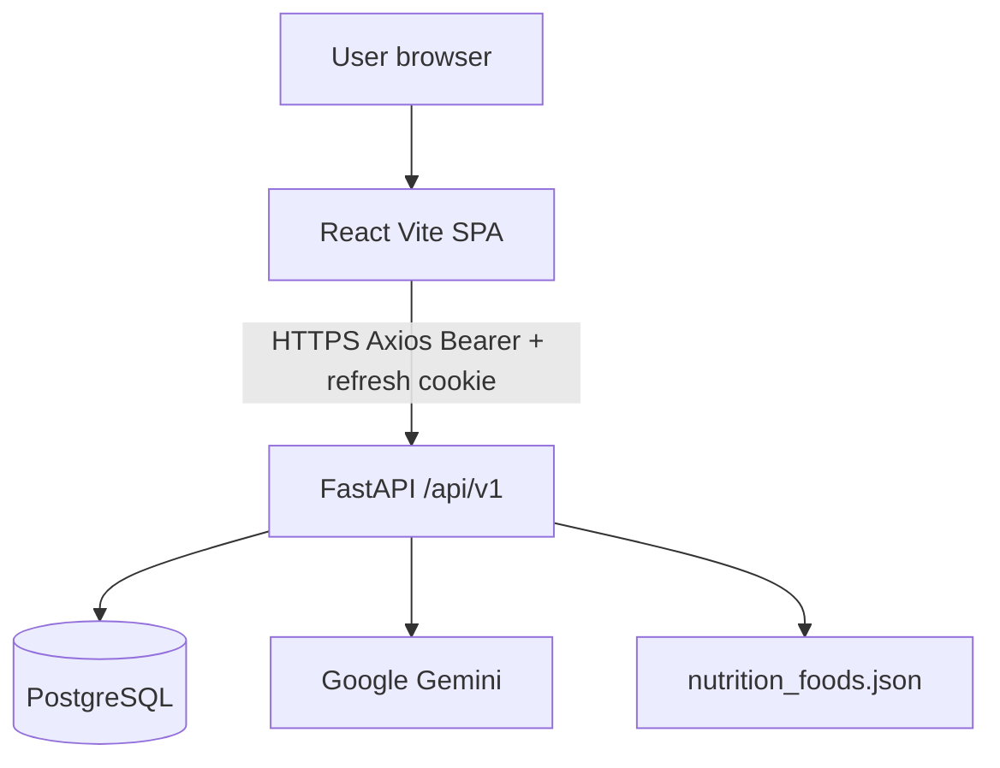
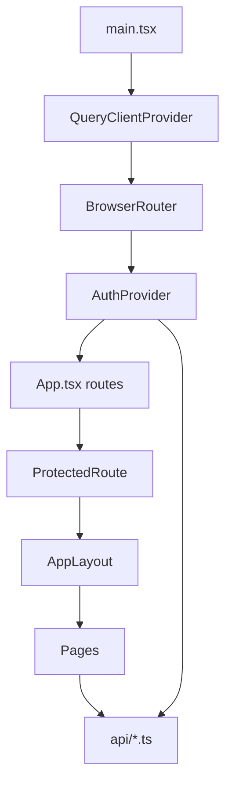
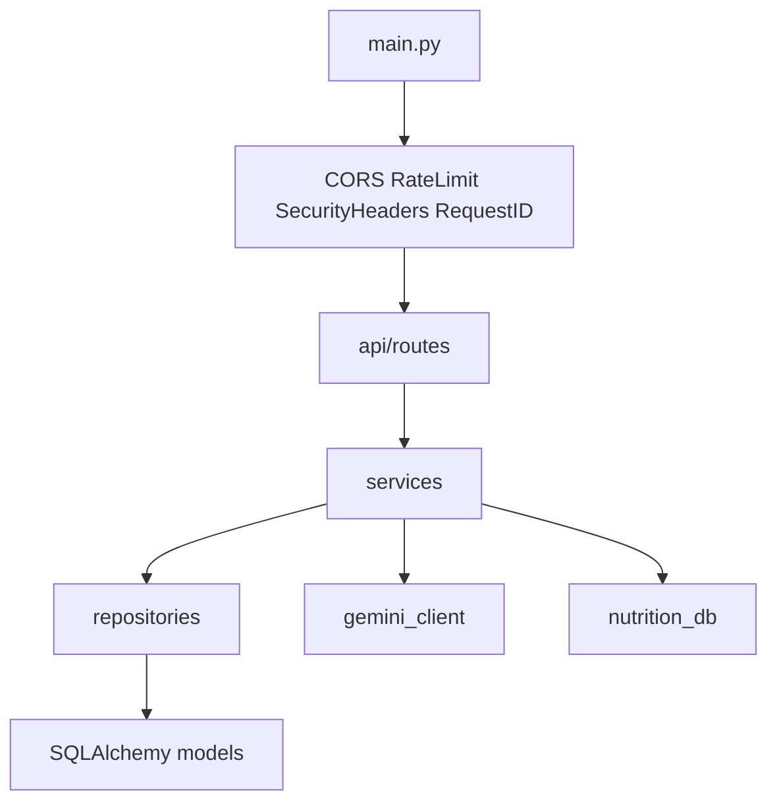
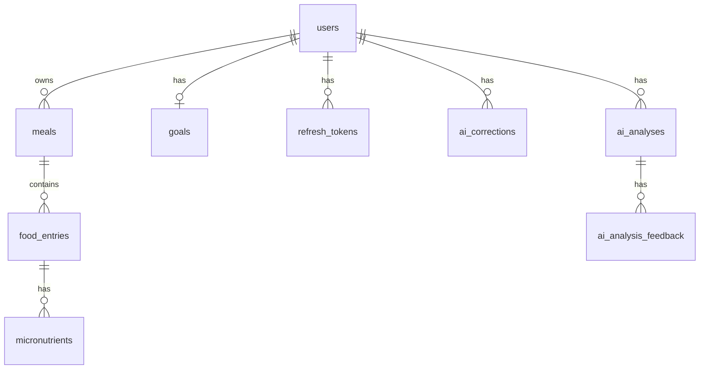
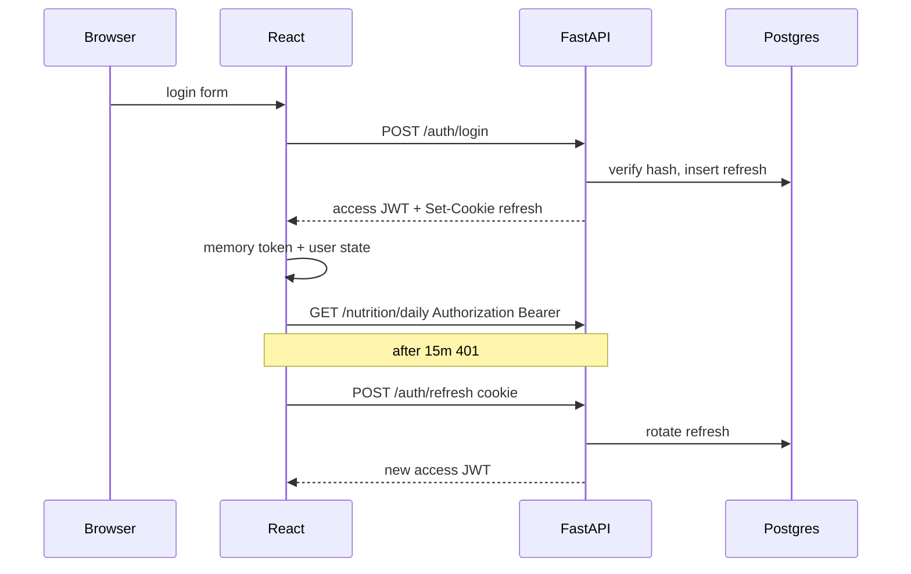
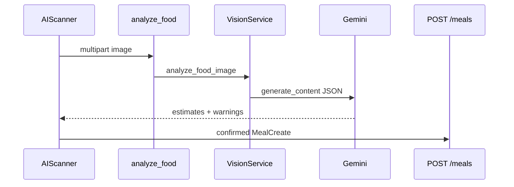
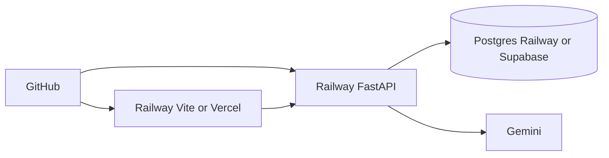
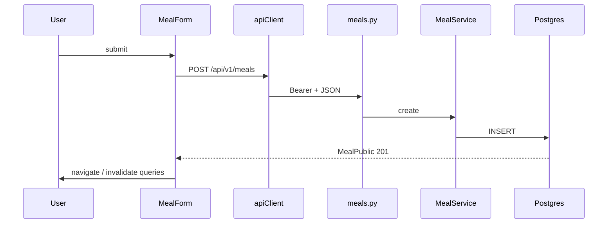

# CALTRACK — COMPLETE INTERVIEW PREPARATION GUIDE

This guide is based on inspecting the CalTrack repository (`Prudhvi-60/CalTrack`), following imports and call chains. It distinguishes **implemented** behavior from **docs-only** or **unused** code.

**Do not claim a library is used just because it is listed in a lockfile.** Usage below is from actual imports.

---

## 1. Executive Summary

CalTrack is a personal calorie/nutrition tracker. A React + TypeScript SPA talks **only** to a FastAPI REST API under `/api/v1`. FastAPI owns authentication, authorization, persistence (PostgreSQL via SQLAlchemy + Alembic), and all Google Gemini calls. The browser never opens Postgres or Gemini.

**Verified live URLs in `README.md` (as of this inspection):**

- Frontend: `https://frontend-production-15c16.up.railway.app`
- API: `https://caltrack-production-c5cd.up.railway.app`
- OpenAPI: `/docs`, health: `/health`

**Deployment docs disagree with the live README.** `docs/DEPLOYMENT.md` describes **Vercel frontend + Railway API + Supabase Postgres**. The live README and `frontend/vite.config.ts` (`allowedHosts` includes `frontend-production-15c16.up.railway.app`) show **Railway hosting the frontend as well**. Interview answer: *“The intended production split is Vercel + Railway + Supabase; the currently advertised live demo runs both UI and API on Railway.”* You cannot prove the live database host from git (only env at runtime). Startup logs classify the host as `supabase`, `railway`, `local`, or `remote` (`backend/app/main.py` `_database_label`).

---

## 2. Project Purpose

Help a signed-in user:

1. Register/login
2. Set daily calorie/macro goals
3. Log meals (manual, AI photo/label, PDF import, chat tools)
4. See today + history + reports (calories, macros, micronutrients, goal vs actual)

AI numbers are **estimates**. Scanner and PDF import do **not** persist until confirm. Chat write tools **do persist** after server-side Pydantic validation.

---

## 3. Features (only what exists)

| Feature | Frontend | API | Persist? |
| --- | --- | --- | --- |
| Register / login / logout / me / password | `Login.tsx`, `Register.tsx`, `Settings.tsx`, `AuthContext.tsx` | `/api/v1/auth/*` | `users`, `refresh_tokens` |
| Goals CRUD (one row per user) | `Goals.tsx` | `/api/v1/goals` | `goals` |
| Meal CRUD + filters + pagination | `Meals.tsx`, `NewMeal.tsx`, `MealEdit.tsx`, `MealDetails.tsx`, `MealForm.tsx` | `/api/v1/meals` | `meals`, `food_entries`, `micronutrients` |
| Dashboard | `Dashboard.tsx` | `/nutrition/daily`, `/weekly`, `/goal-comparison` | reads meals/goals |
| Reports 7/30/90 | `Reports.tsx` | `/nutrition/trends`, `/micronutrients`, `/goal-comparison?days=` | reads |
| AI Scan photo/label | `AIScanner.tsx` | `POST /ai/analyze-food` then `POST /meals` | meals only on confirm; optional `ai_analyses` |
| AI corrections | after confirm in scanner | `POST /ai/corrections` | `ai_corrections`, `ai_analysis_feedback` |
| Chat assistant | `Chat.tsx` | `POST /chat` | writes if tools `create_meal` / `add_food_entry` succeed |
| PDF meal-plan import | `PdfImport.tsx` uses **meal-plan** APIs | `POST /import/meal-plan` + `/confirm` | meals on confirm |
| Table PDF import | **API + `previewPdf` in `importPdf.ts` exist; no page calls them** | `POST /import/pdf` + `/confirm` | unused by UI |
| Health | not a UI page | `/health`, `/health/ready`, `/health/ai`, `/health/db` | n/a |
| Training opt-in | `Settings.tsx` | `PATCH /auth/me` | `users.allow_training_data_collection` |
| Offline food classifier | `training/` scripts | not served by FastAPI | **not in production request path** |

---

## 4. Complete Technology Stack

### Frontend (used)

| Tech | Role | Where |
| --- | --- | --- |
| React 19 | UI | `frontend/src/main.tsx` |
| TypeScript | types | `frontend/tsconfig.json` |
| Vite 6 | bundler/dev | `frontend/vite.config.ts`, `npm run dev/build` |
| React Router 7 | SPA routes | `App.tsx`, `BrowserRouter` in `main.tsx` |
| TanStack Query 5 | server-state cache | `queryClient.ts`, `useMeals`, `useNutrition`, `useGoals` |
| React Context | auth session | `AuthContext.tsx` |
| Axios | HTTP | `api/client.ts` |
| React Hook Form + Zod + `@hookform/resolvers` | forms | Login, Register, Settings, MealForm, Goals |
| Tailwind CSS 3 + PostCSS | styling | `index.css`, `tailwind.config.ts` |
| shadcn-style primitives | Button, Input, Card | `components/ui/*`, `components.json` |
| Radix Slot | `asChild` buttons | `button.tsx` |
| class-variance-authority, clsx, tailwind-merge | class composition | `utils/cn.ts` |
| lucide-react | icons | `AppLayout.tsx` |
| Recharts | charts | `components/charts/*` |
| npm | package manager | `package-lock.json` |
| Vitest + Testing Library + jsdom | unit/UI tests | `*.test.tsx` |
| ESLint | lint | `eslint.config.js` |

**Not used despite common assumptions:** Redux, Zustand, Next.js, Supabase JS, React Query Devtools UI, cookie JS access to refresh token.

**Present in config, lightly used:** `@radix-ui/react-slot` (button only). Not a full Radix design system.

### Backend (used)

| Tech | Role | Where |
| --- | --- | --- |
| Python 3.12 | runtime | `backend/.python-version`, `runtime.txt` |
| FastAPI 0.115 | HTTP API | `app/main.py` |
| Uvicorn | ASGI server | Dockerfile, `railway.toml` |
| Pydantic v2 + pydantic-settings | schemas + env | `schemas/*`, `core/config.py` |
| SQLAlchemy 2.0 (ORM) | DB access | models, repositories, `db/database.py` |
| Alembic | migrations | `alembic/versions/0001`–`0004` |
| psycopg 3 | Postgres driver | `postgresql+psycopg://` |
| python-jose | JWT HS256 | `core/security.py` |
| bcrypt | password hashes | `hash_password` / `verify_password` |
| google-genai | Gemini | `services/ai/gemini_client.py` |
| python-multipart | uploads | analyze-food, import |
| pdfplumber | table PDF parse | `services/pdf/pdf_parser.py` |
| httpx | listed; leftover xAI helper | `provider_http.py` **not imported** |
| pytest | tests | `backend/app/tests/` |
| python-dotenv | via pydantic-settings env files | `config.py` |

**Not implemented:** Celery, Redis, Kafka, GraphQL, Django, Flask, Supabase Auth/RLS, WebSockets.

### Database

PostgreSQL 16 locally (`docker-compose.yml`). Production: documented as **Supabase session pooler**; live host is **runtime `DATABASE_URL`**, which Railway may still point at Railway Postgres unless cut over.

### AI

Google Gemini (`AI_MODEL` default `gemini-3.1-flash-lite`). Only FastAPI calls it.

### Hosting (documented vs live)

| Piece | Documented target | Advertised live |
| --- | --- | --- |
| Frontend | Vercel (`frontend/vercel.json`) | Railway `frontend-production-15c16` |
| Backend | Railway Nixpacks (`backend/railway.toml`) | Railway `caltrack-production-c5cd` |
| DB | Supabase Postgres | Unverified from git |
| AI | Gemini key on Railway | Unverified from git |

**No `.github/workflows`.** No committed CI. Training README *shows example* GitHub Actions YAML; it is **not** in the repo.

---

## 5. Project Structure

```text
CalTrack/
  README.md
  .env.example                 # backend-oriented env template at repo root
  docker-compose.yml           # postgres + backend + frontend (dev image)
  frontend/                    # Vite SPA
  backend/                     # FastAPI app
  docs/                        # architecture, deployment, this guide
  training/                    # offline classifier pipeline (not live inference)
  tests/data/food_images/      # extra image fixtures
```

### Frontend important paths

| Path | Purpose | Imported by |
| --- | --- | --- |
| `frontend/src/main.tsx` | Entry: QueryClient, Router, AuthProvider | Vite `index.html` |
| `frontend/src/App.tsx` | Route table | `main.tsx` |
| `frontend/src/api/client.ts` | Axios instance, refresh interceptor | all API modules |
| `frontend/src/api/token.ts` | **in-memory** access token | client, auth |
| `frontend/src/contexts/AuthContext.tsx` | session restore, login/logout | pages, layout |
| `frontend/src/components/layout/ProtectedRoute.tsx` | auth gate | `App.tsx` |
| `frontend/src/components/layout/AppLayout.tsx` | nav shell | protected routes |
| `frontend/src/pages/*` | screens | `App.tsx` |
| `frontend/src/hooks/useMeals.ts` etc. | React Query wrappers | pages |
| `frontend/vite.config.ts` | alias `@`, `/api` proxy to `:8001` | Vite |

### Backend important paths

| Path | Purpose |
| --- | --- |
| `backend/app/main.py` | FastAPI app, CORS, exception handlers, routers |
| `backend/app/core/config.py` | Settings from env |
| `backend/app/core/security.py` | bcrypt, JWT, refresh hash |
| `backend/app/core/dependencies.py` | `get_current_user` |
| `backend/app/api/routes/*.py` | HTTP endpoints |
| `backend/app/services/*.py` | business logic |
| `backend/app/repositories/*.py` | SQLAlchemy queries |
| `backend/app/models/*.py` | tables |
| `backend/app/schemas/*.py` | request/response Pydantic |
| `backend/app/db/database.py` | Engine |
| `backend/alembic/versions/` | schema history |

**Architecture classification:** **modular monolith** + **layered REST API** (routes → services → repositories → ORM). Not microservices. Not MVC in the Django sense (no template Views). Closest interview label: **layered REST monolith**.

---

## 6. Architecture (actual)

```text
User
  → React SPA (Vite)
      → Axios apiClient (Bearer access token in memory, cookies for refresh)
          → FastAPI /api/v1/*
              → Auth (JWT + refresh_tokens)
              → Services (meals, goals, nutrition, AI, PDF, chat tools)
                  → SQLAlchemy / PostgreSQL
                  → Gemini (scan, chat, meal-plan extract)
                  → JSON nutrition DB (PDF meal-plan matching only)
              → JSON ErrorResponse
      → TanStack Query / AuthContext
  → UI
```

Gemini and Postgres are **never** reached from the browser.

---

## 7. Frontend

**Entry:** `index.html` → `main.tsx` → `App`.

**Routing (`App.tsx`):**

- Guest: `/login`, `/register` (`GuestRoute`)
- Protected + `AppLayout`: `/dashboard`, `/meals`, `/meals/new`, `/meals/:mealId`, `/meals/:mealId/edit`, `/goals`, `/reports`, `/ai-scan`, `/chat`, `/import`, `/settings`
- `/` → `/dashboard`
- unknown protected paths → `NotFound`

**State:**

- Auth: React Context (`user`, `isLoading`). Access token **module variable**, not localStorage.
- Server data: TanStack Query keys `["meals"]`, `["nutrition", ...]`, `["goals"]`. `staleTime` 30s, `refetchOnWindowFocus: false`, retry once except 401/403/404/422.
- Chat messages: **local `useState` only** (lost on refresh).
- AI scan analysis: local state until confirm.

**HTTP:** `apiClient` `withCredentials: true`. Locally `VITE_API_URL` empty → same-origin `/api` via Vite proxy (`vite.config.ts` → `127.0.0.1:8001`). Production: `VITE_API_URL` baked at build (or Railway env for `npm run dev`).

**Loading/error:** Query `isLoading` + `PageSkeleton`; `ErrorAlert` + `getApiErrorMessage` (`api/auth.ts`). Forms: Zod + `formState.errors` + server ErrorAlert.

**Responsive:** Tailwind grids, `AppLayout` desktop nav vs 4-column mobile nav (`lg:hidden`).

**SPA hosting:** `frontend/vercel.json` rewrites all paths to `index.html`. On Railway Vite preview/dev, `allowedHosts` includes the Railway frontend hostname.

---

## 8. Backend

**Entry:** `uvicorn app.main:app`.

**Lifespan:** init/close shared Gemini client.

**Middleware order (Starlette: last added runs first):** CORS → RequestContext → RateLimit → SecurityHeaders.

**Routers** (all except health also at `/api/v1`): auth, goals, meals, nutrition, ai, chat, import, health (mounted twice: `/health` and `/api/v1/health`).

**Errors:** `AppError` → `{ error: { code, message } }`. Validation → 422 `VALIDATION_ERROR`. Unhandled → 500 `INTERNAL_ERROR` (no traceback in body). Request id header `X-Request-ID`.

**Logging:** `caltrack` logger; HTTP access log skips health paths; production suppresses some AppError logs except unexpected refresh 401 handling.

---

## 9. Database

### Tables (Alembic `0001`–`0004`)

```text
users 1──* meals 1──* food_entries 1──* micronutrients
users 1──0..1 goals          (UniqueConstraint user_id)
users 1──* refresh_tokens    (token_hash unique SHA-256)
users 1──* ai_corrections
users 1──* ai_analyses 1──* ai_analysis_feedback
```

**Keys / indexes (implemented):**

- `users.email` unique indexed
- `meals`: `ix_meals_user_id`, `consumed_at`, composite `(user_id, consumed_at)`, `(user_id, meal_type)`
- `food_entries.meal_id`
- `micronutrients.food_entry_id`, `nutrient_name`
- `refresh_tokens`: hash unique, expires_at, `(user_id, revoked_at)`
- CHECKs: non-negative macros, quantities, goal targets
- FKs `ON DELETE CASCADE` (refresh `replaced_by` SET NULL)

**Not a table:** `nutrition_foods.json` + `food_aliases.json` (in-process lookup for PDF meal-plan matching).

**Connection:** `Settings.resolved_database_url` → `sqlalchemy_database_url` (psycopg driver, `sslmode=require` for non-local non-`.railway.internal` hosts). Pool: size 5 / overflow 10, `pool_pre_ping`. Supabase **transaction** pooler port **6543** → `NullPool` + `prepare_threshold=None`.

**Migrations:** production `preDeployCommand = alembic upgrade head`. App does **not** `create_all`.

**Seed:** `python -m scripts.seed` → `demo@caltrack.app` / `DemoPass123!` — local only.

**Credentials:** `DATABASE_URL` or alias `SUPABASE_DATABASE_URL` / `POSTGRES_URL`. Never `VITE_*`. Production refuses empty/localhost/SQLite (`validate_production_settings`).

---

## 10. Authentication

### Registration

`POST /api/v1/auth/register` → `AuthService.register` → unique email, `bcrypt` hash (72-byte cap), issue refresh row, set cookie `caltrack_refresh`, return `{ access_token, token_type, user }` 201.

### Login

`POST /login` → same-looking 401 for bad email/password (`INVALID_CREDENTIALS`). Issues new refresh (old sessions not all revoked on login).

### Access token

HS256 JWT, 15 minutes (`ACCESS_TOKEN_EXPIRE_MINUTES`). Claims: `sub`, `user_id`, `type=access`, `ver` (token_version), `iat`, `exp`. Stored in **JS memory** (`token.ts`). Sent as `Authorization: Bearer`.

### Refresh

`POST /api/v1/auth/refresh` reads HttpOnly cookie path `/api/v1/auth`. Hash lookup. If **already revoked**, **revoke all** (reuse detection). Rotate: new row, old `revoked_at` + `replaced_by`. Cookie: HttpOnly, Secure in production, SameSite `lax` locally / forced `none` if production and lax.

### Logout

`POST /logout` optional Bearer + cookie. Increments `users.token_version` (invalidates access JWTs) and revokes all refresh rows. Clears cookie. Frontend also `setAccessToken(null)` and BroadcastChannel `caltrack-auth`.

### Password change

Verifies current password, new hash, `token_version++`, revoke all refresh.

### Frontend restore

On load: `refreshAccessToken()` then `GET /auth/me`. 401 interceptor retries once via refresh; failure dispatches `caltrack:unauthorized`.

### Authorization

Every meal/goal/nutrition/AI/chat/import route uses `Depends(get_current_user)`. Repositories filter `user_id`. Other user’s meal id → **404** not 403 (`RESOURCE_NOT_FOUND`) — intentional IDOR hiding.

### 60–90 second interview answer

“CalTrack uses our own FastAPI JWT, not Auth0 or Supabase Auth. On register or login the API returns a short-lived access JWT and sets an HttpOnly cookie `caltrack_refresh`. The React app keeps the access token only in a module variable, not localStorage, so a successful XSS cannot read it from storage—though XSS could still call APIs while the tab is open. Axios sends the Bearer header. After 15 minutes a 401 triggers `POST /api/v1/auth/refresh` with credentials; the server hashes the cookie with SHA-256, rotates the row, and returns a new access token. Logout bumps `token_version` so old access tokens fail even before expiry, and revokes refresh rows. Protected React routes wait for AuthContext restore, then redirect to `/login`. All data queries are scoped to `current_user.id`.”

---

## 11. API Architecture

Versioned prefix `/api/v1`. REST resources: `/meals`, `/goals`, `/auth`. RPC-style POSTs for AI/chat/import (not CRUD resources). JSON errors envelope. OpenAPI at `/docs`.

**Why methods:** GET list/read, POST create, PUT replace meal/goals, PATCH partial goals/profile, DELETE remove. Chat/AI/import are POST because they have side effects or bodies/files.

**CORS:** explicit origins from `FRONTEND_URL` + `CORS_ORIGINS`, `allow_credentials=True`, no `*`. Production drops localhost origins.

**Rate limit (implemented):** in-process sliding window: auth 20/min/IP, AI/chat/import 10/min/IP. **Not Redis.** Multi-instance = each replica has its own counters.

---

## 12. Data Flow (real features)

### Login

User submits `Login.onSubmit` → `useAuth().login` → `loginUser` POST `/auth/login` → `AuthService.login` → bcrypt verify → insert `refresh_tokens` → Set-Cookie + JSON → `setAccessToken` + `setUser` → `navigate(from)`.

### Create meal

`MealForm.handleSubmit` → `useCreateMeal` → POST `/meals` → `MealService.create` → insert meal+foods+micros → 201 → invalidate `["meals"]` and `["nutrition"]`.

### Dashboard

`useDailyNutrition` GET `/nutrition/daily` → `NutritionService.daily` sums today’s UTC meals + remaining vs goals. Charts: weekly + goal-comparison queries.

### AI Scan

`AIScanner.onAnalyze` FormData POST `/ai/analyze-food` → `analyze_image` sniff JPEG/PNG/WEBP, size ≤5MB → `VisionService` Gemini JSON → `FoodAnalysisPipeline.finalize_llm_photo` (**nutrition_source=`llm`**, no JSON food DB) → review in `MealForm` → `createMeal` + `recordAiCorrections`.

### Chat

`sendChatMessage` POST `/chat` → `ChatService.ask` injects today’s nutrition snapshot + last 12 messages → Gemini tools up to 6 rounds → `ChatToolbox.execute` same MealService/GoalService as HTTP. **Writes persist immediately.**

### PDF import (UI)

`PdfImport.onFile` → `previewMealPlan` POST `/import/meal-plan` → pdfplumber/OCR text → Gemini extract → match `nutrition_foods.json` → review UI → `confirmMealPlan`. Table `/import/pdf` is **backend-only from the UI’s perspective**.

---

## 13. Error Handling

| Layer | Mechanism |
| --- | --- |
| Frontend network | Axios timeout 30s (60s AI, 120s meal-plan) |
| Frontend mapping | `getApiErrorMessage` by status/code |
| Backend domain | `AppError(code, message, status)` |
| Validation | Pydantic → 422 details |
| Gemini | `map_gemini_error` → 502/429/504/400, secrets redacted |
| DB unique | IntegrityError → 409 duplicate email / GOAL_EXISTS |
| Unhandled | 500 generic |

**Weaknesses:** in-memory rate limit; chat history not durable; nutrition UTC vs local timezone; leftover `provider_http.py` mentions xAI; no client-side circuit breaker; refresh CSRF not tokenized (see Security).

---

## 14. Security

**Implemented:** bcrypt 12 rounds; JWT secret required ≥32 chars in production; refresh hashed; HttpOnly cookie; CORS allowlist; SQLAlchemy parameterized queries; LIKE escape `escape_like`; image magic-byte sniff + pixel limits; PDF size cap; security headers (nosniff, DENY frame, Referrer-Policy, Permissions-Policy, HSTS in production); rate limits on auth/AI; no stack traces; Gemini key only on server; training images not gitignored-committed (`training/data/raw/images/*`).

**Not currently implemented:** CSRF tokens on cookie POSTs; access-token denylist (uses `token_version` instead); Redis rate limit; WAF; email verification; 2FA; RLS at Postgres; virus scan on uploads; Content-Security-Policy (React app); account lockout beyond IP rate limit; storing refresh in Redis.

**XSS:** React text interpolation is escaped. `dangerouslySetInnerHTML` not used in inspected pages. Chat renders `whitespace-pre-wrap` text.

**CSRF:** Meal APIs need Bearer header (not sent by foreign form posts). `POST /auth/refresh` and `/logout` **only need the cookie**. With `SameSite=None; Secure` in production, a cross-site form POST to the API origin could trigger refresh/logout. CORS does not stop non-JS form navigation. Honest answer: *cookie endpoints should use SameSite=Lax on same-site deploy, or double-submit/CSRF token*.

---

## 15. Performance

**Implemented:** meal list pagination; `selectinload` foods/micros; composite indexes; nutrition `macros_by_day` SQL GROUP BY; Query `staleTime` 30s; Gemini client reused process-wide; image size cap.

**Not implemented:** CDN image pipeline (images not stored for serving); Redis cache; HTTP cache headers on nutrition; frontend code-split (Vite may warn >500kB); DB read replicas.

**First bottleneck at 100k users:** Gemini latency/quota and single Railway instance; then in-memory rate limiter ineffectiveness; then Postgres meal/food aggregations per dashboard load; then JWT-less sticky refresh on many dynos is fine (state in DB) but connection pool 5 is small.

---

## 16. Testing

**Backend:** pytest `backend/app/tests/` (~22 modules). FastAPI `TestClient` + transaction rollback (`conftest.py`). Uses **real engine / DATABASE_URL** (not SQLite). Covers auth, meals, goals, nutrition, CORS, AI parsing (mocked completers), chat tools, PDF, production config.

**Frontend:** Vitest + Testing Library. Page tests (Login validation, Dashboard, Goals, Chat, AIScanner, Meals, Reports, PdfImport, NewMeal, App). **Mostly UI/validation; APIs mocked or not hit.** No Playwright/Cypress.

**Missing for production:** e2e login→meal; contract tests against OpenAPI; load tests; mutation tests; visual regression.

---

## 17. Deployment

### Local

1. `cp .env.example .env` and `frontend/.env.example` → `frontend/.env`
2. Leave `VITE_API_URL` empty
3. `docker compose up postgres -d`
4. `backend`: venv, `pip install -r requirements.txt`, `alembic upgrade head`, optional `python -m scripts.seed`, `uvicorn app.main:app --reload --host 127.0.0.1 --port 8001`
5. `frontend`: `npm install`, `npm run dev` → `http://localhost:5173`
6. Optional full compose: frontend Dockerfile runs **`npm run dev`**, maps `VITE_API_URL=http://localhost:8000`

### After git push (actual wiring)

**I could not verify Railway/Vercel dashboard hooks from the repo.** Expected if connected:

- GitHub `main` push → Railway rebuild backend (Nixpacks, `alembic upgrade head`, `uvicorn ... $PORT`)
- If frontend is on Railway: Node service, Vite host allowlist
- If frontend is on Vercel: `npm run build`, `VITE_API_URL` inlined at **build** time

**No GitHub Actions** to run pytest/vitest on push unless you add them.

### Frontend Dockerfile caveat

`CMD npm run dev` is **not** a production static server. Interview: *“Compose/dev image; production should be `npm run build` + nginx or Vercel.”*

---

## 18. Environment Variables

| Variable | Purpose | FE/BE | Secret? | Used where |
| --- | --- | --- | --- | --- |
| `VITE_API_URL` | API origin | FE | No (public) | `client.ts` |
| `VITE_API_BASE_URL` | alias | FE | No | `client.ts` fallback |
| `VITE_API_TIMEOUT_MS` | Axios timeout | FE | No | `client.ts` |
| `VITE_DEV_PROXY_TARGET` | Vite `/api` proxy | FE build/dev | No | `vite.config.ts` |
| `DATABASE_URL` | Postgres URI | BE | **Yes** | `config.py`, Alembic |
| `SUPABASE_DATABASE_URL` | alias | BE | **Yes** | same |
| `POSTGRES_URL` | alias | BE | **Yes** | same |
| `DB_POOL_*` | pool | BE | No | `database.py` |
| `ENVIRONMENT` | `development`/`test`/`production` | BE | No | settings |
| `LOG_LEVEL` | logging | BE | No | `main.py` |
| `JWT_SECRET_KEY` | sign JWT | BE | **Yes** | `security.py` |
| `JWT_ALGORITHM` | default HS256 | BE | No | security |
| `ACCESS_TOKEN_EXPIRE_MINUTES` | 15 | BE | No | security |
| `REFRESH_TOKEN_EXPIRE_DAYS` | 14 | BE | No | auth_service |
| `COOKIE_SECURE` / `COOKIE_SAMESITE` | refresh cookie | BE | No | `cookies.py` |
| `RATE_LIMIT_ENABLED` | toggle | BE | No | `rate_limit.py` |
| `AUTH_RATE_LIMIT_PER_MINUTE` | 20 | BE | No | rate_limit |
| `AI_RATE_LIMIT_PER_MINUTE` | 10 | BE | No | rate_limit |
| `GEMINI_API_KEY` / `AI_API_KEY` / `GOOGLE_API_KEY` | Gemini | BE | **Yes** | gemini_client |
| `AI_PROVIDER` | must be Gemini in prod | BE | No | config |
| `AI_MODEL` | model id | BE | No | gemini + `/health/ai` |
| `AI_TIMEOUT_SECONDS` | 45 | BE | No | settings |
| `AI_MAX_UPLOAD_BYTES` | 5MB | BE | No | analyze/import |
| `AI_MIN_CONFIDENCE` | 0.5 | BE | No | settings field (check usage before claiming scans use it) |
| `FRONTEND_URL` / `CORS_ORIGINS` | CORS | BE | No | CORS middleware |
| `BACKEND_HOST` / `BACKEND_PORT` | local bind | BE | No | examples; uvicorn CLI actually used |
| `PORT` | Railway injects | BE | No | railway.toml |
| `RAILWAY_ENVIRONMENT` / `RAILWAY_PROJECT_ID` | detect Railway; skip loading `.env` | BE | No | config |
| `TRAINING_DATA_DIR` | image dump | BE | No | `feedback_service.py` |

**Safe in browser:** only `VITE_*`. **Never** DB, JWT, Gemini.

**Missing var:** production startup `RuntimeError` if `DATABASE_URL`/JWT invalid; frontend prod logs `VITE_API_URL is not set` and API calls go to relative empty origin (broken).

**Dev vs prod:** local JWT default allowed (warning); prod rejects default secret; prod CORS ignores localhost; prod cookie SameSite none; Railway does not load packaged `.env`.

---

## 19. Git / GitHub

- Repo: `https://github.com/Prudhvi-60/CalTrack`
- Default branch `main` (history shows initial upload + deployment/README polish)
- `.gitignore`: `.env`, venv, `node_modules`, `frontend/dist`, training images/jsonl/checkpoints
- **Never commit:** `.env`, `JWT_SECRET_KEY`, `DATABASE_URL`, `GEMINI_API_KEY`, real user images
- No Actions workflows
- README demo video `docs/demo/Demo_Video.mp4`

`docs/requirements-checklist.md` is **stale** in places (says logout is stateless without denylist; code now rotates/revokes refresh + `token_version`). Do not recite the checklist blindly.

---

## 20. Important Files

1. `backend/app/main.py`
2. `backend/app/core/config.py`
3. `backend/app/core/security.py`
4. `backend/app/core/dependencies.py`
5. `backend/app/core/cookies.py`
6. `backend/app/services/auth_service.py`
7. `backend/app/api/routes/*.py`
8. `backend/app/services/meal_service.py`
9. `backend/app/services/nutrition_service.py`
10. `backend/app/services/ai/gemini_client.py`
11. `backend/app/services/ai/chat_service.py`
12. `backend/app/services/ai/chat_tools.py`
13. `backend/app/repositories/meal_repository.py`
14. `frontend/src/api/client.ts`
15. `frontend/src/contexts/AuthContext.tsx`
16. `frontend/src/App.tsx`
17. `backend/railway.toml`
18. `frontend/vite.config.ts`

---

## 21–22. Important Functions and Code Flows

See Phase 16 table below (section 21 in this master doc is merged with “Important Code”).

---

## 23. Technology Decisions (WHAT / WHY / HOW / TRADEOFF / CALTRACK)

**React vs Next.js:** SPA is enough; no SEO for private dashboard. Tradeoff: client-side auth flash; `vercel.json` rewrites needed.

**FastAPI vs Django:** JSON API + Pydantic + async-ready ASGI, OpenAPI free. Django would add unused ORM admin weight; you still used SQLAlchemy.

**PostgreSQL vs Mongo:** relational meals/foods/goals, constraints, Alembic. Mongo would weaken integrity of macros CHECK and FKs.

**JWT + refresh cookie vs sessions:** API-friendly; access not in localStorage. Tradeoff: cross-site cookies (`SameSite=None`) when UI and API on different hosts.

**Gemini vs only a local model:** vision/chat quality without training data. Cost, latency, 503 if key missing. `training/` is future classifier, **not** live.

**TanStack Query vs Redux:** cache/invalidation for REST; auth is small Context.

**Tailwind vs CSS-in-JS:** utility speed, design tokens in `index.css`.

**Railway:** simple Git deploy for FastAPI + `$PORT`. Vercel better for static SPA.

---

## 24. Technical Challenges (visible in git)

1. Cross-origin cookies (localhost vs 127.0.0.1; Vercel vs Railway) — comments in `frontend/.env.example`, CORS tests, `COOKIE_SAMESITE=none`.
2. Gemini JSON parsing / non-food images (`pipeline.py`, tests).
3. PDF: table parser vs Gemini meal-plan path; UI only uses meal-plan.
4. Production DB URL rewriting and refusing localhost on Railway (`database_url.py`).
5. Token rotation + reuse detection (`AuthService.refresh`).

---

## 25. Known Limitations

- UTC calendar days, not device TZ
- Chat not persisted
- In-memory rate limits
- Frontend prod image in Docker is Vite **dev**
- Docs vs live hosting mismatch
- `provider_http.py` leftover xAI
- `training/README.md` still says `gpt-4o-mini`
- Registry claims nutrition DB for vision; **photo path uses LLM macros**
- Table PDF API unused by UI
- No e2e / no CI
- Bundle size warning
- Goals list pagination is ceremonial (max one row)
- Login does not revoke other devices’ refresh tokens (only logout/password change)
- `AI_MIN_CONFIDENCE` is a setting; photo pipeline uses hard-coded 0.55 for low-confidence warnings

---

## 26. Improvements (realistic)

1. Put frontend on Vercel static build; API+cookie on a shared parent domain
2. GitHub Actions: pytest + npm test + build
3. Redis rate limit + optional refresh store cleanup job
4. Playwright e2e
5. Persist chat; confirm UX for chat writes
6. Timezone-aware days
7. Delete or wire `provider_http.py` / table-PDF UI
8. CSP + CSRF on cookie routes
9. Split charts with `React.lazy`

---

## 27. Architecture Diagrams

### High-level



### Frontend



### Backend



### Database



### Authentication



### AI Scan API



### Deployment (two possible)



### Request lifecycle (log meal)



---

## 28–31. Pitches

### 30-second

“CalTrack is a full-stack nutrition tracker I built with React and FastAPI. You sign in, set calorie goals, and log meals by form, photo, PDF, or chat. The browser only talks to my REST API. Postgres stores your data; Gemini runs on the server for vision and chat. Nothing from a photo is saved until you confirm.”

### 60-second

Add: JWT access in memory, HttpOnly refresh cookies, per-user queries, dashboard/reports over UTC days, Alembic migrations, Railway API. AI key never in Vite.

### 2-minute

Walk: register → goals → meal form validation (Zod + Pydantic) → dashboard remaining macros → AI scan pipeline → chat tools calling the same MealService → PDF meal-plan match against JSON food DB → confirm save. Mention indexes, 404 for other users’ IDs, rate limits, health/ready.

### 5-minute technical

Use sections 6–12 plus auth sequence, schema, deployment mismatch honesty, what you’d change (CI, Vercel static, CSRF, timezones).

---

## 21. Important Code (15–25 pieces)

For each: know inputs/outputs/bugs.

1. **`get_current_user`** (`dependencies.py`) — Bearer decode; compare `token_version`; 401.
2. **`create_access_token` / `decode_access_token`** — HS256; reject non-access type.
3. **`AuthService.refresh`** — reuse ⇒ revoke all.
4. **`apiClient` interceptor** — single-flight refresh; skip auth URLs.
5. **`MealRepository.get_for_user`** — `Meal.id` AND `user_id`.
6. **`MealService._require`** — 404.
7. **`NutritionService.goal_comparison`** — period target = daily × day count.
8. **`analyze_image`** — type sniff vs Content-Type mismatch 400.
9. **`FoodAnalysisPipeline.finalize_llm_photo`** — `nutrition_source: llm`.
10. **`ChatService.ask`** — 6 tool rounds; 502 if exceeded.
11. **`ChatToolbox.execute`** — Pydantic tools; unknown tool fails closed.
12. **`RateLimitMiddleware`** — per-IP path key; not distributed.
13. **`sqlalchemy_database_url`** — postgres:// rewrite; sslmode.
14. **`validate_production_settings`** — JWT length, Gemini, CORS nonempty.
15. **`AuthProvider.restore`** — refresh then `/me`.
16. **`ProtectedRoute`** — “Checking session…”.
17. **`paginated`** — total_pages.
18. **`escape_like`** — search injection.
19. **`set_refresh_cookie`** — path `/api/v1/auth` so cookie **not** sent to `/meals`.
20. **`FeedbackService.start_analysis`** — production skips disk unless `TRAINING_DATA_DIR`.
21. **`VisionService._complete`** — 503 `AI_NOT_CONFIGURED`.
22. **`PdfImport` page** — `previewMealPlan` not `previewPdf`.
23. **`queryClient.clearUserQueries`** — logout cache leak prevention.

**Possible bugs to admit:** cookie path means refresh cookie is not sent to non-auth paths (good); chat writes without confirm; UTC vs local; reuse detection logs user out of all sessions if stolen token is replayed (good security, surprising UX).

---

## 32. Basic Interview Questions (25)

**Q1. What is CalTrack?**  
Testing: can you describe your own project.  
Strong: problem + users + stack in two sentences.  
CalTrack: personal nutrition tracker, React SPA + FastAPI + Postgres + Gemini.  
Follow-up: demo URL.  
Defend: point at README features that exist in `App.tsx`.

**Q2. What is the frontend framework?**  
React 19 SPA via Vite, not Next. `main.tsx`.

**Q3. What is the backend framework?**  
FastAPI in `app/main.py`.

**Q4. What database?**  
PostgreSQL + SQLAlchemy 2 + Alembic.

**Q5. How do you start locally?**  
Postgres docker, alembic, uvicorn `:8001`, npm run dev, empty `VITE_API_URL`.

**Q6. What is REST?**  
Resource URLs, HTTP verbs. CalTrack `/api/v1/meals`.

**Q7. What is a JWT?**  
Signed claims. Access token `type=access`, `ver`.

**Q8. Where is the token stored?**  
Memory, not localStorage (`token.ts`).

**Q9. What is CORS?**  
Browser origin check. `CORSMiddleware` + `cors_origin_list`.

**Q10. What is an ORM?**  
SQLAlchemy models `User`, `Meal`, …

**Q11. GET vs POST?**  
GET nutrition; POST meals/chat.

**Q12. What is hashing?**  
bcrypt passwords; SHA-256 refresh.

**Q13. What is an environment variable?**  
`GEMINI_API_KEY` on server only.

**Q14. What does `/health` do?**  
Process liveness, no DB. Ready hits `SELECT 1`.

**Q15. How is the UI styled?**  
Tailwind + tokens in `index.css`.

**Q16. What is a component?**  
e.g. `MealForm` reused by new/edit/scan.

**Q17. What is React Query used for?**  
Cache meals/nutrition; invalidate on mutation.

**Q18. Protected routes?**  
`ProtectedRoute` + `isAuthenticated`.

**Q19. Pagination?**  
`page`, `page_size` on meals; `PaginatedResponse`.

**Q20. Meal types?**  
Enum BREAKFAST/LUNCH/DINNER/SNACK.

**Q21. Who calls Gemini?**  
Only backend `gemini_client.py`.

**Q22. Alembic?**  
`0001`–`0004`, Railway pre-deploy.

**Q23. Error JSON shape?**  
`{ error: { code, message, details? } }`.

**Q24. Package managers?**  
npm frontend, pip `requirements.txt` backend.

**Q25. Tests?**  
pytest + vitest; no e2e.

*(For Q1–Q25: follow-up is usually “show me the file”; defend by naming the file.)*

---

## 33. Intermediate (25)

**Q1. Why Axios interceptors?**  
Central 401 → refresh once (`refreshInFlight`).

**Q2. Why HttpOnly refresh?**  
JS cannot read cookie; XSS cannot steal refresh as easily as localStorage.

**Q3. Why cookie path `/api/v1/auth`?**  
Browser only attaches refresh on auth routes.

**Q4. How are meals isolated?**  
`get_for_user(user_id, meal_id)` → 404.

**Q5. PUT vs PATCH goals?**  
PUT replace all; PATCH `exclude_unset`, at least one field.

**Q6. How are remaining calories computed?**  
`remaining(target, actual)` in `utils/nutrition.py`; GoalService uses today’s UTC macros.

**Q7. N+1?**  
`selectinload` food_entries.

**Q8. Image validation?**  
Magic bytes + declared type + 5MB + pixel cap.

**Q9. Chat tools security?**  
Model does not get a DB session; `ChatToolbox` uses current user services + Pydantic.

**Q10. Why 409 GOAL_EXISTS?**  
`uq_goals_user_id`.

**Q11. Decimal vs float?**  
Numeric columns; Pydantic `ge=0`.

**Q12. Vite proxy why?**  
Same-site cookies locally.

**Q13. Production JWT check?**  
`validate_production_settings`.

**Q14. Rate limiting limitations?**  
Process-local dict.

**Q15. OpenAPI?**  
FastAPI autogen `/docs`.

**Q16. Why 404 not 403 on others’ meals?**  
Avoid leaking existence.

**Q17. Micronutrients?**  
Child rows; aggregated in NutritionService.

**Q18. Forms validation layers?**  
Zod client, Pydantic server.

**Q19. Query invalidation?**  
`invalidateMealRelated`.

**Q20. SSL to Supabase?**  
`_ensure_sslmode`.

**Q21. NullPool when?**  
Port 6543 transaction pooler.

**Q22. BroadcastChannel?**  
Multi-tab logout.

**Q23. Analysis not saved until confirm?**  
Scan returns JSON; POST meals separate. Chat exception.

**Q24. LIKE search?**  
`escape_like` then SQL LIKE.

**Q25. Health vs ready?**  
Orchestrators: liveness vs Postgres.

---

## 34. Advanced (25)

**Q1. Refresh token rotation / reuse.**  
Replay revoked token → `_revoke_all`.

**Q2. token_version vs denylist.**  
Stateless JWT + integer epoch; logout increments.

**Q3. SameSite=None implications.**  
Needed cross-site; CSRF on cookie POSTs.

**Q4. bcrypt 72-byte truncation.**  
Explicit slice; passwords max 72 in schema.

**Q5. Gemini JSON robustness.**  
`response_mime_type` JSON, parsers, `NOT_FOOD`.

**Q6. Tool-call loop bound.**  
`_MAX_TOOL_ROUNDS = 6`.

**Q7. Pool sizing Railway.**  
5+10; session pooler 5432 preferred.

**Q8. Why not create_all in prod?**  
Drift; Alembic is source of truth.

**Q9. IDOR test strategy.**  
Two users; fetch other id 404 (`test_meals.py` pattern).

**Q10. UTC vs local.**  
`utc_day_start` / timezone UTC in macros_by_day.

**Q11. In-memory access token + refresh cookie split.**  
XSS vs CSRF tradeoff.

**Q12. Multipart Content-Type.**  
Axios interceptor deletes JSON content-type for FormData.

**Q13. Train vs serve.**  
`training/` not on request path; Gemini remains production vision.

**Q14. Opt-in images.**  
`allow_training_data_collection`; prod may skip disk write.

**Q15. Exception handler doesn’t leak.**  
`INTERNAL_ERROR` message generic; `logger.exception` server-side.

**Q16. CORS credentials + headers allowlist.**  
Authorization, Content-Type, X-Request-ID.

**Q17. Enum meal_type native PG.**  
Alembic `meal_type` enum.

**Q18. Replace meal food_entries.clear().**  
Orphaned rows cascade.

**Q19. Pagination of computed arrays.**  
Trends paginate in Python after building day points — weak at 90 days only 90 points, OK.

**Q20. Race two goal creates.**  
IntegrityError → 409.

**Q21. Chat history trust.**  
Client sends history; server prepends authoritative snapshot. User could spoof history text but tools still scoped.

**Q22. Model prompt injection.**  
Tools still validated; cannot change user_id.

**Q23. HSTS only production.**  
`SecurityHeadersMiddleware`.

**Q24. get_settings lru_cache.**  
Tests must override carefully (`test_production_config`).

**Q25. leftover provider_http.**  
Dead xAI mapper; don’t say you use xAI.

---

## 35. Architecture Questions (20)

**Q1. Why monolith?**  
One assignment-sized product; one deployable API. Split later if Gemini queue needed.

**Q2. Why not BFF?**  
SPA is the only client.

**Q3. Layers?**  
Routes thin; services transactions; repos queries.

**Q4. Why JSON nutrition file?**  
Deterministic matching without USDA API key; stale data tradeoff.

**Q5. Sync FastAPI routes?**  
Def/async mix: file reads async; DB sync Session. Honest: blocking Gemini on worker thread risk — uvicorn workers.

**Q6. Where should domain math live?**  
`utils/nutrition.py` not frontend.

**Q7. Multi-tenant?**  
Row-level `user_id`, not schemas.

**Q8. Event sourcing?**  
Overkill; CRUD meals.

**Q9. Caching nutrition?**  
Could cache daily by user+date; not done.

**Q10. Frontend as BFF-less.**  
All secrets backend.

**Q11. Modular monolith folders.**  
`services/ai`, `services/pdf`.

**Q12. Why REST not GraphQL?**  
Simple resources; would overfetch less for dashboard (3 calls today) — GraphQL optional.

**Q13. Fail partial dashboard.**  
Three queries; one error Alert from first error object.

**Q14. Idempotency?**  
POST meals not idempotent; retries could duplicate. Admit it.

**Q15. Background jobs?**  
None; training is CLI.

**Q16. Feature flags?**  
None; Gemini off → 503.

**Q17. API versioning.**  
`/api/v1` prefix only.

**Q18. Contract between FE/BE.**  
TS types duplicated vs Pydantic — drift risk.

**Q19. Docker compose vs prod.**  
Compose for local; Railway Nixpacks prod.

**Q20. Read replica?**  
Not needed yet; report queries are per-user range.

---

## 36. Database Questions (20)

**Q1. Draw ER.**  
See mermaid.

**Q2. Why CHECK constraints?**  
Cannot persist negative calories even if bug bypasses Pydantic.

**Q3. Why Numeric?**  
Money/macro precision.

**Q4. Index choice.**  
List meals by user+time.

**Q5. Cascade delete user.**  
Wipes meals.

**Q6. Soft delete?**  
Not implemented.

**Q7. Transactions?**  
Service `commit`; request scoped session.

**Q8. Isolation?**  
Default READ COMMITTED.

**Q9. Concurrent meal edit.**  
Last PUT wins; no version column. Admit lost update.

**Q10. Search query.**  
Food name LIKE, escaped.

**Q11. Aggregations.**  
`macros_by_day` join food_entries group by UTC date.

**Q12. Unique email.**  
DB + 409.

**Q13. Refresh hash unique.**  
Lookup O(1) index.

**Q14. Why not store JWT refresh plaintext?**  
Theft of DB would reuse sessions.

**Q15. Seed vs migrations.**  
Alembic schema; seed demo data.

**Q16. JSON foods vs table.**  
No joins to USDA; deploy with app version.

**Q17. Connection pool exhaustion.**  
5 connections per instance.

**Q18. SQLite forbidden prod.**  
`validate_production_settings`.

**Q19. timezone-aware DateTime.**  
`DateTime(timezone=True)`.

**Q20. micronutrient units.**  
Free string unit; name enum-ish on create.

---

## 37. Frontend Questions (20)

**Q1. Why React?**  
Component UI, ecosystem, SPA dashboard.

**Q2. State management?**  
Context auth + React Query server.

**Q3. Routing?**  
React Router nested routes.

**Q4. Talk to backend?**  
Axios `apiClient`.

**Q5. Loading/error?**  
Query flags + ErrorAlert.

**Q6. Responsive?**  
Tailwind breakpoints, mobile nav.

**Q7. Improve architecture?**  
Route-based code split; shared API types; e2e.

**Q8. Why RHF?**  
Field arrays for foods.

**Q9. Charts?**  
Recharts; colors `theme/palette.ts`.

**Q10. GuestRoute?**  
Logged-in users cannot see login.

**Q11. StrictMode?**  
Double effects in dev; restore abort flag `cancelled`.

**Q12. Why not persist chat?**  
Simple; weakness.

**Q13. datetime-local?**  
`fromDateTimeLocal` to ISO.

**Q14. shadcn?**  
Copied Button/Input; not full install runtime.

**Q15. Test approach?**  
jsdom, MemoryRouter.

**Q16. staleTime 30s?**  
Fewer dashboard refetches.

**Q17. File preview?**  
`URL.createObjectURL` revoke on cleanup.

**Q18. Reports query string?**  
`useSearchParams` days.

**Q19. Accessibility?**  
Skip link, aria-busy, labels.

**Q20. Bundle?**  
`tsc -b && vite build`; size warning documented.

---

## 38. Backend Questions (20)

**Q1. Entry point?**  
`app.main:app`.

**Q2. Depends(get_db)?**  
Yield session, close.

**Q3. AppError vs HTTPException?**  
Typed codes for clients.

**Q4. Why services?**  
Reuse by chat tools.

**Q5. Repositories?**  
Testable queries.

**Q6. Gemini client singleton?**  
Avoid reconnect; close on shutdown.

**Q7. Sync SQLAlchemy in FastAPI?**  
Blocking; scale with workers.

**Q8. File upload limits?**  
Settings 5MB.

**Q9. Logging PII?**  
No password logs; Gemini sanitizer regex.

**Q10. CORS production localhost strip.**  
`cors_origin_list`.

**Q11. Optional user on logout.**  
Cookie-only logout works.

**Q12. TokenResponse includes user.**  
Fewer roundtrips.

**Q13. Meal totals computed.**  
`sum_food_macros` not stored.

**Q14. Why not store totals?**  
Avoid denormalization drift.

**Q15. pdfplumber vs Gemini.**  
Tables vs unstructured diaries.

**Q16. TestClient overrides get_db.**  
Rollback.

**Q17. python-jose vs PyJWT.**  
Used jose.

**Q18. Enum StrEnum.**  
API strings.

**Q19. lifespan Gemini.**  
Warm client.

**Q20. Root `/`.**  
Name, docs, health links.

---

## 39. API Questions (20)

**Q1. Explain API architecture.**  
Versioned REST + a few RPC POSTs; Pydantic I/O; Bearer auth; cookie refresh; unified errors.

**Q2. Status codes?**  
201 register/create meal; 401; 404; 409; 413 file; 422; 429; 502 Gemini; 503 no key; 504 timeout.

**Q3. Why POST chat?**  
Not idempotent, body.

**Q4. Query params meals.**  
date wins over range (`list_meals` description).

**Q5. page_size max 100.**  
Query ge/le.

**Q6. File + form analysis_type.**  
`food` | `label`.

**Q7. Corrections endpoint.**  
Does not retrain.

**Q8. Health/ai never returns key.**  
Boolean configured.

**Q9. Pagination on goals.**  
Even one row.

**Q10. Confirm re-validates.**  
PDF confirm uses schemas not trust preview.

**Q11. Authorization header scheme.**  
HTTPBearer.

**Q12. withCredentials.**  
Cross-site cookie.

**Q13. Timeout FE vs BE.**  
FE 30s; AI 45s server.

**Q14. 204 vs 200 message.**  
DELETE returns `{message}`.

**Q15. Filtering meal_type enum.**  
Invalid → 422.

**Q16. OpenAPI security.**  
Bearer optional auto_error False.

**Q17. Idempotent PUT meals.**  
Replace full document.

**Q18. Import confirm body.**  
Client-edited rows; server validates.

**Q19. Error details list.**  
Validation only.

**Q20. Duplicate prefix health.**  
`/health` and `/api/v1/health`.

---

## 40. Deployment Questions (15)

**Q1. Where is it hosted?**  
API Railway; UI advertised Railway; docs Vercel. Be honest.

**Q2. Start command?**  
`uvicorn app.main:app --host 0.0.0.0 --port ${PORT:-8000}`

**Q3. Pre-deploy?**  
`alembic upgrade head`

**Q4. VITE_API_URL bake-in?**  
Vite inlines at build; change requires rebuild.

**Q5. Why not put Gemini on Vercel?**  
Secret + server-only.

**Q6. Nixpacks vs Dockerfile.**  
railway.toml Nixpacks; Dockerfile exists.

**Q7. Healthcheck path.**  
`/health` not ready (so deploy “up” even if DB down until traffic).

**Q8. Compose frontend dev server.**  
Not production.

**Q9. No CI.**  
Tests not auto on push.

**Q10. Custom domain cookies.**  
Shared parent domain allows SameSite=Lax.

**Q11. Railway injects PORT.**  
Don’t hardcode 8000 in prod.

**Q12. Skip .env on Railway.**  
`RAILWAY_*` set → no env_file.

**Q13. Cutover Postgres.**  
Dump/restore before switching DATABASE_URL.

**Q14. vercel.json rewrites.**  
SPA deep links.

**Q15. allowedHosts Railway frontend.**  
Vite blocks unknown hosts otherwise.

---

## 41. Security Questions (15)

**Q1. Auth?**  
See 90-second answer.

**Q2. Passwords?**  
bcrypt 12, never stored plain.

**Q3. JWT secret?**  
Env, prod min 32.

**Q4. CSRF?**  
Not currently implemented on cookie routes. Would add SameSite=Lax same-site or CSRF token.

**Q5. XSS?**  
React escape; token not in localStorage.

**Q6. SQLi?**  
ORM + escaped LIKE.

**Q7. IDOR?**  
user_id in query.

**Q8. Rate limit?**  
In-memory; missing at scale.

**Q9. Secrets in git?**  
gitignore `.env`.

**Q10. HTTPS?**  
Assumed at Railway/Vercel; HSTS header in prod.

**Q11. Upload abuse?**  
Type sniff, size, rate limit.

**Q12. Prompt injection?**  
Tools bound to user.

**Q13. Email enumeration?**  
409 on register duplicate; login generic 401.

**Q14. Session fixation?**  
New refresh on login.

**Q15. Training data privacy?**  
Opt-in flag default false.

---

## 42. Debugging Questions (15)

Use Phase 21 scenarios (below) as answers.

---

## 43. Scenario Questions (15)

**Q1. Two users update same meal.**  
No locking; last write wins. Add `updated_at` if-match later.

**Q2. Gemini down.**  
502 `AI_PROVIDER_ERROR`; meals still work.

**Q3. DB down.**  
`/health` ok, `/ready` fails; CRUD 500.

**Q4. Token expired mid-form.**  
Interceptor refresh; else login.

**Q5. Scale 100k.**  
Queue Gemini, more API workers, managed Postgres, Redis limiter, CDN SPA, cache daily nutrition.

**Q6. User uploads 20MB.**  
413.

**Q7. Wrong CORS.**  
Browser blocks; Network tab.

**Q8. Chat logs meal.**  
Immediate insert; tell interviewer you’d add confirm.

**Q9. PDF messy.**  
Review UI; unknown nutrition_status.

**Q10. Change password other tabs.**  
token_version; 401.

**Q11. Missing VITE_API_URL prod.**  
console.error; API calls fail.

**Q12. Transaction pooler.**  
NullPool.

**Q13. Replay refresh.**  
All sessions die.

**Q14. Local login drop.**  
Used API URL cross-site without cookie.

**Q15. Interviewer: did you use Cursor?**  
Yes for speed; I own auth/data flow, can walk `AuthService` and `MealRepository`.

---

## 44. Pressure Interview (CalTrack-specific)

**Why this architecture?**  
Browser must not hold DB or AI keys; REST matches CRUD meals; one Python API is operable for a student project.

**Why Postgres?**  
Constraints, joins for daily totals, Alembic.

**Why not Firebase?**  
Wanted SQL + own JWT for the course’s backend requirement.

**DB down?**  
Ready fails; UI ErrorAlert; no local cache.

**Two updates?**  
Lost update; no ETag.

**Unauthorized access?**  
JWT + user_id filters + 404.

**Validate input?**  
Zod + Pydantic + CHECK.

**Token expire?**  
Refresh cookie; else login.

**Frontend logged in?**  
`user !== null` after restore.

**API fail?**  
getApiErrorMessage; Query error.

**Scale?**  
Gemini and DB first.

**Biggest weakness?**  
Deployment/docs split; no CI/e2e; chat writes; UTC; in-memory limiter; Vite dev Docker.

**Rebuild?**  
Next.js or Vite static on Vercel, shared domain, OpenAPI-generated TS client, job queue for AI.

**Hardest problem?**  
Cross-site refresh cookies + Gemini structured output (evidence: cookie settings, parsing tests).

**Click Log meal:** MealForm → POST `/meals` → MealService.create → INSERT → invalidate queries → dashboard refetch.

**Where it fails?**  
Gemini timeout, CORS, cookie SameSite, missing env, pooler SSL, 5MB, rate limit, UTC confusion.

---

## 45. Knowledge Gaps

### MUST KNOW

- Request path React → Axios → FastAPI → SQLAlchemy/Gemini
- Access vs refresh storage
- `get_current_user` + `token_version`
- Meal IDOR 404
- Confirm vs chat persist
- Photo nutrition is LLM not JSON DB
- PDF UI uses `/import/meal-plan`
- Env vars public vs secret
- Railway start/migrate
- UTC days
- Error envelope

### SHOULD KNOW

- Refresh reuse detection
- Rate limiter internals
- Alembic four revisions
- Nutrition GROUP BY
- Feedback/training opt-in
- CORS origin construction
- Vite proxy

### NICE TO KNOW

- pdfplumber table path
- training pipeline quality_gate
- image pixel parsing
- leftover xAI file
- chart color tokens

---

## Debugging scenarios (Phase 21)

### Frontend blank / fail

Symptoms: white screen. Causes: JS exception, wrong base path, Router. Order: DevTools console, Network for `index.js`, `main.tsx` root id `root`. Isolate: `npm run build` local. Fix: missing `#root` or syntax.

### Backend 500

Symptoms: ErrorAlert server message. Causes: unhandled exception, DB. Order: Railway logs `Unhandled error rid=`, reproduce `/docs`. Files: `main.py` handler, service. Fix: missing column (run alembic), None deref.

### Database

Symptoms: ready 500. Causes: DATABASE_URL, SSL, DNS. `SELECT 1` health. `database_url.py`. Fix URI/sslmode.

### Auth

Symptoms: bounce to login. Causes: cookie blocked, CORS, token_version, clock. Network: `/auth/refresh` 401. Check SameSite, FRONTEND_URL exact origin, Vite proxy.

### CORS

Symptoms: browser CORS error. Fix exact origin no slash; credentials true; not `*`.

### Deployment

Symptoms: 404 `/login` on static host without rewrite. Fix `vercel.json`. Railway frontend: `allowedHosts`.

### Env

Symptoms: AI 503 `AI_NOT_CONFIGURED`. Set `GEMINI_API_KEY` on API service; redeploy. FE: rebuild after `VITE_API_URL`.

### API 404

Wrong `VITE_API_URL` includes `/api/v1` twice, or trailing path.

### Build fail

`tsc -b` type error; lockfile; Node version. Frontend 20+ README vs Docker Node 22.

### Network

Mixed content HTTP API from HTTPS UI. Always HTTPS Railway.

---

## Deployment failure simulation (Phase 22)

**UI up API down:** FE loads, all Axios network errors. Check Railway API, `/health`.

**API up DB down:** `/health` ok, `/ready` fail, login 500.

**CORS prod:** Vercel URL not in `CORS_ORIGINS`.

**Missing JWT prod:** process crash `RuntimeError` on import/settings.

**Build local ok Vercel fail:** env Node, `tsc`.

**Blank site:** SPA rewrite missing or JS error from undefined `import.meta.env`.

**Wrong API URL:** baked env; inspect built JS for railway host (no secrets).

**DB credentials:** Railway logs `Database URL: configured` never prints URI; connection error in SQLAlchemy.

**API 404:** service root not `backend` so routes missing.

**GitHub doesn’t deploy:** no Actions; check Railway/Vercel GitHub app. I could not verify webhook from repo.

---

## Interview answer framework (Phase 27)

1. WHAT — definition  
2. WHY — problem it solves  
3. HOW — CalTrack file/function  
4. TRADEOFF — alternative  
5. EXAMPLE — one endpoint  

Example PostgreSQL: relational engine / integrity / SQLAlchemy models + Alembic `0001` / vs Mongo / `meals.user_id` FK cascade.

Apply to React, FastAPI, JWT, Gemini, Tailwind, Query, Railway.

---

## Honest quality (Phase 29)

**Genuinely good:** layered API; IDOR-safe queries; refresh rotation; unified errors; Gemini only on server; confirm-before-save for scan/PDF; indexes; tests for auth/meals/AI parsing; production settings guards.

**Basic:** Goals UI, chat local state, duplicated TS/Pydantic types, Docker frontend dev.

**Fragile:** cross-site cookies; in-memory limiter; docs/live hosting mismatch; stale README/training/checklist.

**Over-engineered:** training pipeline + registry while production vision is still Gemini; dual PDF import stacks; goal list pagination for one row.

**Missing:** CI, e2e, CSRF, timezone, CSP, idempotency keys.

**Safe honesty line:**  
“That’s an area I’d harden for production. Today it does X because Y (student timeline / demo). At scale I’d Z.”

**Questions that expose not knowing the code:**

- Does photo analysis use `nutrition_foods.json`? (**No.**)
- Does the Import page call `/import/pdf`? (**No.**)
- Is logout only deleting a client token? (**No — token_version + revoke.**)
- Is the live frontend on Vercel? (**README says Railway.**)
- Do you use xAI/OpenAI? (**Gemini. Dead xAI helper file.**)
- Redux? (**No.**)
- Supabase Auth? (**No, hosted Postgres only if configured.**)

---

## 46. One-page Cheat Sheet

**Purpose:** Track calories/macros with optional AI assist.

**Features:** Auth, goals, meals, dashboard, reports, AI scan, chat, PDF meal-plan import.

**Architecture:** React SPA → FastAPI `/api/v1` → Postgres + Gemini.

**Stack:** React19, Vite, TS, Tailwind, TanStack Query, Axios, RHF/Zod, Recharts | FastAPI, SQLAlchemy, Alembic, bcrypt, python-jose | Postgres | Gemini | Railway (API; UI live Railway; docs Vercel) | npm/pip

**Key files:** `main.tsx`, `App.tsx`, `client.ts`, `AuthContext.tsx`, `main.py`, `security.py`, `auth_service.py`, `meal_service.py`, `nutrition_service.py`, `gemini_client.py`, `chat_tools.py`, `railway.toml`

**Key APIs:**  
`POST /auth/register|login|refresh|logout`  
`GET|PATCH /auth/me`  
`CRUD /meals` `CRUD /goals`  
`GET /nutrition/daily|weekly|trends|micronutrients|goal-comparison`  
`POST /ai/analyze-food` `POST /ai/corrections`  
`POST /chat`  
`POST /import/meal-plan` + `/confirm`

**DB:** users–meals–food_entries–micronutrients; users–goals 1:1; refresh_tokens; AI feedback tables.

**Auth:** Access JWT memory 15m; refresh HttpOnly cookie 14d hashed in DB; rotate; logout bumps token_version.

**Deploy:** Push GitHub → Railway (alembic + uvicorn $PORT). Frontend env `VITE_API_URL`. CORS `FRONTEND_URL`.

**Biggest challenge:** Credentialed cookies across origins + structured Gemini output.

**Biggest strength:** Clear API boundary and per-user data isolation.

**Biggest weakness:** No CI/e2e; hosting docs vs live; chat persists without confirm.

**Future:** CI, Vercel static, shared domain cookies, Redis limits, timezones, queue AI.

---

# FINAL STUDY PLAN

## 1-Day Preparation

1. **Morning (3h):** Walk login → meal → dashboard in code (files in cheat sheet). Draw ER + sequence for auth.  
2. **Midday (2h):** AI scan + chat tools + PDF meal-plan vs unused table PDF.  
3. **Afternoon (2h):** Env vars, CORS, cookies, Railway vs Vercel story.  
4. **Evening (2h):** Recite 90s auth, 2-min pitch, pressure answers, limitations.  
5. **Night (1h):** Skim pytest names so you can say what is tested.

## 3-Hour Crash Course

1. 30 min: architecture + stack + what is **not** used  
2. 45 min: auth end-to-end  
3. 30 min: meals/nutrition SQL  
4. 30 min: Gemini flows  
5. 20 min: deployment/env  
6. 25 min: weaknesses + “what I’d improve”

## 30-Minute Revision

- Memory JWT + HttpOnly refresh + token_version  
- `/api/v1` only from browser  
- IDOR 404  
- Scan confirm vs chat write  
- LLM photo vs JSON DB on PDF  
- UTC  
- Railway API; live UI Railway; intended Vercel  
- No GitHub Actions  
- 503 without Gemini key  
- Honest weaknesses

## Top 20 Things To Memorize

1. React SPA + FastAPI + Postgres + Gemini  
2. Prefix `/api/v1`  
3. Access token in RAM  
4. Cookie `caltrack_refresh` path `/api/v1/auth`  
5. HS256 15 minutes / refresh 14 days  
6. bcrypt + SHA-256 refresh  
7. `get_current_user`  
8. One goal per user  
9. Meal indexes `(user_id, consumed_at)`  
10. Totals computed not stored  
11. Nutrition UTC  
12. Analyze-food does not insert meals  
13. Chat tools **do** insert  
14. UI import = `/import/meal-plan`  
15. `nutrition_foods.json` for PDF matching  
16. Rate limit in-process  
17. Alembic `0004_ai_feedback` head  
18. `VITE_*` public only  
19. `alembic upgrade head` then uvicorn `$PORT`  
20. Docs ≠ live frontend host

## Top 20 Questions Most Likely

1. Walk me through login.  
2. Where do you store tokens and why?  
3. What happens when the access token expires?  
4. How do you prevent user A from seeing user B’s meals?  
5. Explain your database schema.  
6. How does the dashboard get remaining calories?  
7. What happens when I upload a food photo?  
8. Does AI auto-save meals?  
9. How does chat log a meal?  
10. How do you call Gemini without exposing the key?  
11. How is the app deployed?  
12. What env vars exist?  
13. How do you handle CORS?  
14. What if the database is down?  
15. How do you validate input?  
16. What tests do you have?  
17. How would you scale this?  
18. What’s the biggest weakness?  
19. Why FastAPI and React?  
20. Show me the request from button click to SQL.

---

# If you understand these things, you should be able to confidently explain CalTrack to a technical interviewer.

Prioritize **auth, user isolation, meal/nutrition flow, Gemini boundary, and deployment honesty**. If you can open `auth_service.py`, `client.ts`, `meal_repository.py`, and `analyze_service.py` and narrate them, you will look like the author of the system—not someone who only read a generated README.
